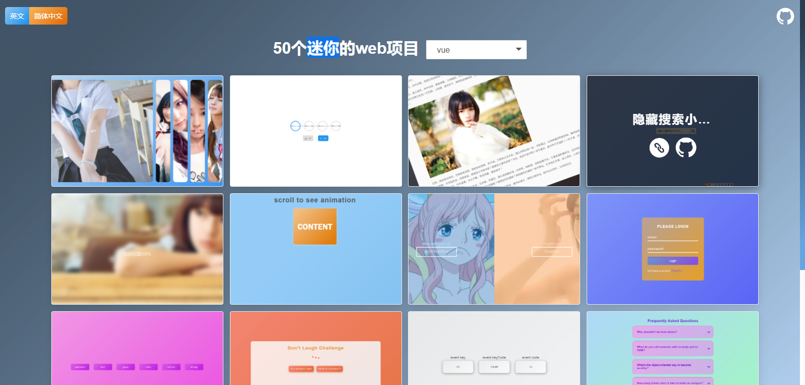

# 50 mini web project website 

How to run? Do as follows:

```shell
yarn install
```

then

```shell
yarn dev
```

then,open the browser and input the url `http://localhost:8081`,you can see as the picture shows:

;

let's go!


