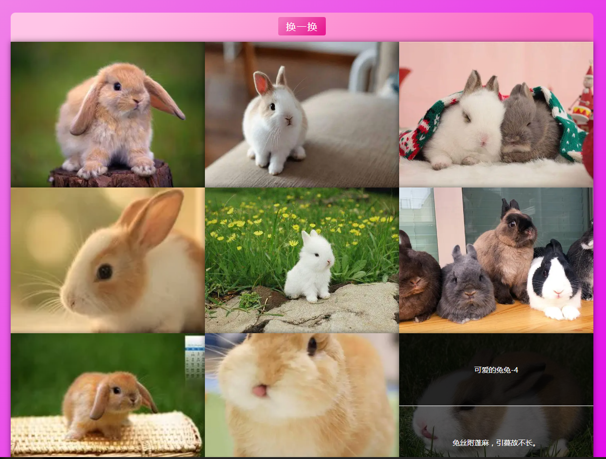

# 作兔器——手写一个可爱的兔兔相册展示器

兔岁既来，为迎兔岁，更以为兔兔甚是可怜，故作一兔相册展示器，以藏兔图。而今先顾此效，如下所示:



> 自译: 兔年既然来了，为了表示欢迎兔年的到来，而且我也认为兔兔很是可爱，令人喜欢，因此写了一个兔兔相册展示器，用来收藏可爱的兔兔图片，现在让我们先来看看这个相册展示器的效果吧，正如下面所展示的:

据上而知，此器可分三成，一则为头部，头部含一按钮，点此可随意见兔之图，二则为图区，图区不限，此例乃九，每一区见一兔，鼠标移之可得一词以述兔也，所述则同分为二，其一乃题，其二乃文，文即一词。

> 自译: 根据上图我们可以知道，这个兔兔相册展示器可以分成三个部分，第一个部分就是一个标题栏头部，标题栏头部有一个按钮，点击这个按钮可以随机的展现兔兔的图片，第二个部分则是兔兔的图片展示区域，这个展示区域可以分成多个部分，在这个例子当中是九个图区，每一个图区就会展示一个兔兔，鼠标移上去可以看到一首词来描述兔兔。这个描述同样分成了两部分，第一部分就是标题，第二部分就是内容，内容就是一首诗。

三则为细品兔图,鼠标击之，可得一黑盒，黑盒中位，即为兔图，鼠标复击之，即可关之。由之可见，其有动效，如何实之？需有二者，其一为定时器，其二乃以透明度为效，如是娓娓道来。

> 自译： 第三个部分则是详细的预览图片，通过使用鼠标点击图片，就可以得到一个黑色的背景遮罩，在黑色背景遮罩的中间位置，就是兔兔的图片，鼠标再次点击就可以关闭详细预览。从这里我们可以看到，这个关闭和打开都是有动画效果的，那么我们如何实现这个动画效果呢？第一部分很显然我们需要用到定时器，第二部分就是通过修改透明度达到效果，接下来让我们一一来看每一部分的实现吧。

其一，构之 HTML 元素:

> 自译： 第一步，当然是编写 html 元素。

```html
<div class="rabbit-box">
  <header class="rabbit-box-header">
    <button type="button" class="rabbit-box-header-btn">换一换</button>
  </header>
  <div class="rabbit-box-album"></div>
</div>
```

如上所示，应知外有容器元素，内有标题元素与兔图容器元素，其内更有一按钮元素，使之可更兔图，兔图容器之内，乃元素抽成，如之奈何？

> 自译: 正如上面所展示的，我们应该知道最外层有一个容器元素,里面又有一个标题元素以及一个装满兔子图片的容器元素，在标题元素中还有一个按钮元素，可以让它来随机更换兔子图片，兔子图片内部的元素正好是动态生成的元素，我们应该怎么做呢？

使我等估之如下:

> 自译: 让我们猜测 html 元素结构应该如下所示:

```html
<div class="rabbit-box-album-item" data-title="..." data-content="...">
  
</div>
```

甚易，构之大成，因而画之美样，但其乃易，故可径直赏码矣。

> 自译: 太简单了，构建元素大功告成，因此我们只需要用 css 样式美化一下即可，不过因为这也同样简单，因此我们只需要直接查看代码即可。

```css
* {
  margin: 0;
  padding: 0;
  box-sizing: border-box;
}
body,
html {
  height: 100%;
  overflow: hidden;
}
body {
  overflow-y: auto;
  padding: 2em;
  background: linear-gradient(135deg, #f184e8 10%, #e209e9 90%);
}
.rabbit-box {
  width: 100%;
  max-width: 1200px;
  display: flex;
  justify-content: center;
  align-items: center;
  flex-direction: column;
  margin: auto;
}

.rabbit-box-header {
  width: 100%;
  background: linear-gradient(135deg, #ffc5e7 10%, #fa6cc4 90%);
  height: 60px;
  border-radius: 10px 10px 0 0;
  text-align: center;
  line-height: 60px;
}

.rabbit-box-header-btn {
  outline: none;
  border-radius: 4px;
  padding: 0.4rem 1rem;
  border: none;
  transition: all 0.4s cubic-bezier(0.075, 0.82, 0.165, 1);
  display: inline-block;
  color: #fff;
  cursor: pointer;
  background: linear-gradient(135deg, #f173bd 10%, #e71b92 90%);
  letter-spacing: 2px;
  font-size: 20px;
  font-family: '微软雅黑', '楷体';
}

.rabbit-box-header-btn:hover,
.rabbit-box-header-btn:active {
  background: linear-gradient(135deg, #f060b4 10%, #e60f8c 90%);
}

.rabbit-box-album {
  width: 100%;
  height: 100%;
  display: flex;
  flex-wrap: wrap;
}

.rabbit-box-album-item {
  width: 33.3333%;
  height: 300px;
  overflow: hidden;
  box-shadow: 0 0 12px rgba(0, 0, 0, 0.5);
  cursor: pointer;
  position: relative;
}

.rabbit-box-album-item::before,
.rabbit-box-album-item::after {
  position: absolute;
  color: #fff;
  font-size: 15px;
  width: 100%;
  height: 50%;
  display: flex;
  justify-content: center;
  align-items: center;
  left: 0;
  transition: transform 0.4s ease-in-out;
  text-overflow: ellipsis;
  overflow: hidden;
  white-space: nowrap;
}

.rabbit-box-album-item::before {
  content: attr(data-title);
  top: 0;
  background-color: rgba(0, 0, 0, 0.85);
  transform: translateY(-100%) scale(0);
}
.rabbit-box-album-item::after {
  content: attr(data-content);
  bottom: 0;
  background-color: rgba(0, 0, 0, 0.65);
  border-top: 1px solid #fff;
  transform: translateY(100%) scale(0);
}

.rabbit-box-album-item:hover.rabbit-box-album-item::before,
.rabbit-box-album-item:hover.rabbit-box-album-item::after {
  transform: translateY(0) scale(1);
}
.rabbit-box-album-item-img {
  display: block;
  width: 100%;
  height: 100%;
  object-fit: cover;
}
@media screen and (max-width: 900px) {
  .rabbit-box-album-item {
    width: 100%;
    height: 200px;
  }
}

::-webkit-scrollbar {
  width: 4px;
  height: 4px;
  background-color: #f1f1f1;
}

::-webkit-scrollbar-thumb {
  width: 4px;
  height: 4px;
  background-color: #ee4f9e;
}
```

甚易，皆凡样也，故无需多言以述之，使我等望功码。

> 自译: 太简单了，都是一些常规的布局样式，因此没有必要说太多来解释，让我们来看功能代码的实现吧。

其一，有一构造函数，函数一对参，参内二属，一为 resources,二为 el,resources 乃对组，对内有三属，分为 src,title,content,顾名思义，src 为兔图之源，title 为标题，content 为内容，el 则为容器元素，值乃字符，顾可得如下:

> 自译: 首先我们会创建一个构造函数，构造函数有一个对象参数，对象参数里面是二个属性，第一个是 resources,第二个则是 el,resources 为一个对象数组，对象里面分别有三个属性，分别是 src,title,content,从名字就能想到其中的含义，src 代表兔兔图片的路径，title 就是标题,content 就是内容，el 则代表是容器元素，是一个字符串，因此我们就可以得到如下代码:

```js
const resources = [
    {
        src:"./images/rabbit-1.png",
        title:"可爱的兔兔-1",
        content:"雄兔脚扑朔，雌兔眼迷离。"
    },
    {
        src:"./images/rabbit-2.png",
        title:"可爱的兔兔-2",
        content:"兔走乌驰人语静，满溪红袂棹歌初。"
    },
    {
        src:"./images/rabbit-3.png",
        title:"可爱的兔兔-3",
        content:"白兔捣药成，问言与谁餐？"
    },
    {
        src:"./images/rabbit-4.png",
        title:"可爱的兔兔-4",
        content:"兔丝附蓬麻，引蔓故不长。"
    },
    {
        src:"./images/rabbit-5.png",
        title:"可爱的兔兔-5",
        content:"白兔捣药秋复春，嫦娥孤栖与谁邻。"
    },
    {
        src:"./images/rabbit-6.png",
        title:"可爱的兔兔-6",
        content:"吴质不眠倚桂树，露脚斜飞湿寒兔。"
    },
    {
        src:"./images/rabbit-7.png",
        title:"可爱的兔兔-7",
        content:"茕茕白兔，东走西顾。"
    },
    {
        src:"./images/rabbit-8.png",
        title:"可爱的兔兔-8",
        content:"可笑常娥不了事，走却玉兔来人间。"
    },
    {
        src:"./images/rabbit-9.png",
        title:"可爱的兔兔-9",
        content:"兔走乌驰人语静，满溪红袂棹歌初。"
    }
];
const rabbit = new RabbitAlbum({
    resources: ,
    el:".rabbit-box-album"
})
```

使我等见构造函数如下:

> 自译: 让我们来看看构造函数的实现如下:

```js
class RabbitAlbum {
  constructor(options) {
    this.animation = Object.create(null);
    this.initAnimation();
    this.container = RabbitAlbum.$(options.el) || document.body;
    this.imageList = options.resources || [];
    this.createAlbum();
  }
}
```

如上初始所属，内有二方，其一为 initAnimation,意即初始动效,其二为 createAlbum,意即生兔图也，三属分为 animation,container,imgList，即动效,容器元素,兔图对组。

> 自译: 以上我们初始化所有的属性，里面有二个方法，第一个方法就是 initAnimation，意思就是初始化动画，第二个方法就是 createAlbum,意思就是生成兔子图片，三个属性分别是 animation,container,imgList,也就是动画效果，容器元素，兔兔图片对象数组。

有一$,乃是静方，使我等见之如下:

> 自译: 有一个$方法，就是一个静态方法，让我们来看看如下所示:

```js
RabbitAlbum.$ = (selector, el = document) => el.querySelector(selector);
```

甚易,其乃 document.querySelector 方包耳!。另有二静方，为 getCss,\_create,使我等见之如下:

> 自译: 太简单了，就是 document.querySelector 方法的包装罢了。另外还有二个静态方法，那就是 getCss,\_create,让我们来看看如下所示:

```js
RabbitAlbum.getCss = (el, prop) => window.getComputedStyle(el, null)[prop];
RabbitAlbum._create = name => document.createElement(name);
```

getCss 为 window.getComputedStyle 方包耳!,\_create 为 document.createElement 方包耳!甚易，如视 createAlbum 方，后见 initAnimation 方。

> 自译: getCss 就是 window.getComputedStyle 方法的包装罢了,\_create 就是 document.createElement 方法的包装罢了,接下来我们先来看 createAlbum 方法，最后再看 initAnimation 的实现。

```js
createAlbum(){
    const randomSort = this.imageList.sort((a,b) => Math.random() > 0.5 ? -1 : 1);
    let template = '';
    randomSort.forEach(item => {
        template += `
            <div class="rabbit-box-album-item" data-title="${item.title}" data-content="${item.content}">
                
            </div>
        `;
    });
    this.container.innerHTML = template;
    this.container.addEventListener('click',e => {
        if(e.target.className.includes('rabbit-box-album-item')){
            if(e.target.firstElementChild){
                const src = e.target.firstElementChild.getAttribute('src');
                this.preview(src);
            }
        }
    })
}
```

其一，乱序兔图对组，编之生兔图元素，入 container 为子元素，为 container 元素增击事，断之乃图元素，而取 src 属，调 preview 方也。

> 自译: 首先将兔图对象数组打乱顺序，遍历这个数组生成兔图元素，添加到 container 容器元素中作为子元素，然后给 container 元素添加点击事件，判断是否是图片元素，然后获取 src 属性，调用 preview 方法。

使我等见 preview 方如下:

> 自译: 让我们来看看 preview 方法如下:

```js
preview(src,time = 600){
    const imgTag = RabbitAlbum._create('img'),
          imgMask = RabbitAlbum._create('div');
    imgMask.style.cssText += 'position:fixed;left:0;top:0;right:0;bottom:0;background:rgba(0,0,0,0.5);z-index:9999;';
    imgTag.style.cssText += 'position:absolute;left:50%;top:50%;transform:translate(-50%,-50%);width:auto;height:auto;border-radius:5px;';
    imgMask.id = 'previewMask';
    imgTag.src = src;
    imgMask.appendChild(imgTag);
    const mask = RabbitAlbum.$("#previewMask");
    if (!mask) {
        document.body.appendChild(imgMask);
        this.animation.fadeIn(imgMask, time);
    } else {
        document.body.replaceChild(imgMask, mask);
        this.animation.fadeIn(imgMask, time);
    }
    imgMask.addEventListener('click',  e => {
        const el = e.target.tagName.toLowerCase().indexOf('img') > -1 ? e.target.parentElement : e.target;
        this.animation.fadeOut(el, time);
    }, false)
}
```

其一生 img 元素与 div 元素，分为增样，后入 body 元素，调 fadeIn 方见之，为 div 元素增击事，因而隐之。

> 自译: 第一步生成 img 和 div 元素，分别添加样式，然后添加到 body 元素中，然后调用 fadeIn 方法显示它们，并且为 div 元素添加点击事件，从而达到隐藏它们。

何知 fadeIn 方与 fadeOut 方焉? 如之奈何？使我等观之。其一生时管器，如下:

> 自译: 是不是有些熟悉 fadeIn 方法和 fadeOut 方法?如何实现呢?让我们一起来看看吧，首先是需要创建一个时间管理器，如下:

```js
class TimerManager {
  constructor() {
    this.timers = [];
    this.args = [];
    this.isTimerRun = false;
  }
  add(timer, args) {
    this.timers.push(timer);
    this.args.push(args);
    this.timerRun();
  }
  timerRun() {
    if (!this.isTimerRun) {
      const timer = this.timers.shift(),
        args = this.args.shift();
      if (timer && args) {
        this.isTimerRun = true;
        timer(args[0], args[1]);
      }
    }
  }
  next() {
    this.isTimerRun = false;
    this.timerRun();
  }
}
TimerManager.makeTimerManage = element => {
  if (
    !element.TimerManage ||
    element.TimerManage.constructor !== TimerManager
  ) {
    element.TimerManage = new TimerManager();
  }
};
TimerManager.runNext = element => {
  if (element.TimerManage && element.TimerManage.constructor === TimerManager) {
    element.TimerManage.next();
  }
};
```

其效如何? 生组而存定时器，后一一取出调之，甚易，使我等观 fadeIn 方与 fadeOut 方,二者所似，知其一便知其二也，皆以定时器增减 opacity 矣。

> 自译: 这个时间管理器的用处是什么呢？也就是创建一个数组存储定时器，然后每次都从这个数组当中取出一个，然后调用它，这很简单，让我们来说看看 fadeIn 与 fadeOut 方法的实现。两个方法的实现原理都很类似，知道其中一个方法的实现便知道另一个方法的实现，它们都是通过定时器增加或者是减少 opacity 即可。

```js
fadeIn(element,time){
    element.style.transition = "opacity" + time + " ms";
    if (!Number(RabbitAlbum.getCss(element, 'opacity')) || !parseInt(RabbitAlbum.getCss(element, 'opacity')) <= 0) {
        element.style.display = "none";
        element.style.opacity = 0;
        let curAlpha = 0,
            addAlpha = 1 * 100 / (time / 10),
            timer = null;
        let handleFade = function () {
            curAlpha += addAlpha;
            if (element.style.display === 'none'){
                element.style.display = "block";
            }
            element.style.opacity = (curAlpha / 100).toFixed(2);
            if (curAlpha >= 100) {
                if (timer) clearTimeout(timer);
                element.style.opacity = 1;
                TimerManager.runNext(element);
            } else {
                timer = setTimeout(handleFade, 10);
            }
        }
        handleFade();
    } else {
        TimerManager.runNext(element);
    }
}
```

甚易，后使我等观 initAnimation 方，如下:

> 很简单，最后让我们来看看 initAnimation 方法 的实现，如下所示:

```js
initAnimation(){
    const _self = this;
    if(typeof this.animation['fadeIn'] !== 'function'){
        this.animation['fadeIn'] = function(element,time = 400){
            TimerManager.makeTimerManage(element);
            element.TimerManage.add(_self.fadeIn, arguments);
            return this;
        }
    }
    if(typeof this.animation['fadeOut'] !== 'function'){
        this.animation['fadeOut'] = function(element,time = 400){
            TimerManager.makeTimerManage(element);
            element.TimerManage.add(_self.fadeOut, arguments);
            return this;
        }
    }
}
```

甚易，初始 fadeIn 方与 fadeOut 方，后入元素矣。

> 自译: 很简单，就是初始化 fadeIn 和 fadeOut 方法，把它们添加到元素当中就行了。

综上，可得作兔器也，使我等观之。

> 自译: 综上所述，我们的兔兔相册管理器就实现了，让我们来看看最后的效果吧。
