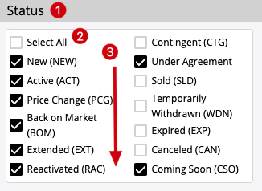

TypeScript React Multi-Check Testing Program
============================================

## Code Interview Process 

Please follow the task requirements, the component style should be matched the screenshot.

You have seven days to do it.

- Create a new branch based on master instead of fork.
- [Create the PR](../../pulls) when you finished.
- Please communicate in English. Do not use Chinese in your Code, especially code and commits' comments.

If you have any questions, please feel free to [raise the issue](../../issues) in the repo. We're glad to help you.

Please let me know when your PR's ready for review.

## Notice:

This is a simplified component from real project.
When you do it, consider it as a real task, and show your best programming practices.
Your code will be reviewed and scored by the other developers of the team you will join.

Your code will have higher score if:

1. You split the task into smaller tasks, complete them one by one, and commit them in different git commits with proper commit messages 
1. The code is clean and easy to read and understand
2. The variable and function names are considered carefully
3. Small and meaningful functions for complex logic
4. No typo and has good code format
5. Meaningful, carefully organized test cases covered most of the important functionality (very important)
6. Provide proper/valuable comments, but only when it's necessary (in code and/or in github PR). Try improving the code to avoid un-necessary comments. 

## Task

Implement a react function component with typescript.

1. typescript + react
2. unit tests: use `jest` + `@testing-library/react`, etc.
3. provide proper comments in code (and only when it's necessary) 
4. show your best practise
5. use github pull request to submit your code

Find `TODO` in code to implement, you can also change any code in codebase to make it better.

## Component Requirement:



1. The component has a label
2. The special `Select All` option
   1. if checked, all other options are checked
   2. if unchecked, all other options are unchecked
   3. if all other options are checked, it should be checked
   4. if any other option are unchecked, it should be unchecked
3. The options support multiple-columns, and the direction is from top to bottom in each column

### The layout example

Suppose

```
options =  ['aaa', 'bbb', 'ccc', 'ddd', 'eee', 'fff'] 
columns = 3
```

There are seveal posibilities:

1. not preferred
```
Select All   ccc      fff
aaa          ddd
bbb          eee
```

2. preferred
```
Select All   ccc       eee
aaa          ddd       fff
bbb           
```

Make the column sizes as even as possible, and put extra options in the first several columns, and also make them even,
so the 2nd solution is preferred.

### Performance requirement

You can add proper react hooks in the component to avoid unnecessary component-level renders if no state changes

## Dev

```
npm install
npm run dev
```

## Test

```
npm test
```

Notice:
1. Please use html native checkbox (`<input type="checkbox" />`) as the base,
   the style doesn't need to be exactly the same
2. No need to test `App.tsx`, only test MultiCheck and related components and code
4. Please follow the best Typescript style and best practices
