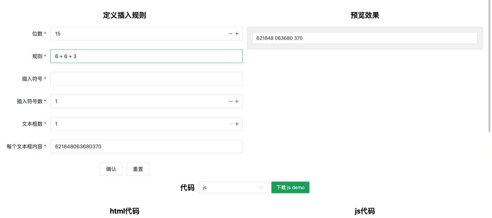

# 难以置信，一个小小的需求让我捣鼓出一个提效的网站来

## 需求介绍

事情是这样的，有个群友在业务当中碰到一个小小的需求，需求是这样的: 页面当中存在多个输入框，输入框的 value 值是一个数值组成的字符串（盲猜应该是身份证号码），这个字符串的位数是 15 位或者是 18 位，例如:'621848063680370'(15 位)和'621848063688370808'(18 位)，然后默认的值是这样的，现在问题来了，需求希望在这些数值中插入空白符号，比如 15 位的数字就按照 6 + 6 + 3 的格式分隔，分隔的时候需要使用空白符号。比如'621848063680370'分隔后应该变成'621848 063680 370',也就是数字位数到了第 6 位就加个空白符号分隔，...依次类推，而 18 位数字的分割规则则是:6 + 4 + 4 + 4。比如'621848063688370808'应该分隔成'621848 0636 8837 0808'。

这个需求就是对字符串的处理，提到分隔替换，那么我们就可以想到强大的字符串替换方法 replace，这个方法可以接受 2 个参数，一个参数通常是一个正则表达式，第二个参数则是一个回调函数，用于定义替换后返回字符串。因此，我的第一个想法就是使用正则表达式去处理，如何处理呢？

## 原理分析

首先我们需要去理解这个规则，从需求我们可以发现，不同的位数，规则就会有所不同，因此我们可以提前用一个数据来表示这种规则，为了保持良好的扩展性，我设计了如下字段:

```ts
type spaceRule = {
  digit: number; // 位数
  rule: RegExp; //规则
  symbolNumber: number; // 插入符号数量
  symbolName: string; // 插入符号
};
```

可以看到，我设计了四个参数，正如注释所说，每一个参数都有具体的含义,为什么要如此设计参数呢？还是看需求，我们需求首先是限定了数字的位数，只可能是 15 位或者是 18 位，那如果存在 19 位又或者 20 位的场景呢？因此我们需要设计一个位数的参数，然后是每一个位数对应的规则是不一样的，因此我们也需要设计一个 rule 参数，然后是插入符号数量，也许会存在 1 个空白，2 个空白等等场景，或者我们不一定插入空白符号，也有可能是其它符号例如"-"等等，因此就设计 symbolNumber 和 symbolName 参数。

既然规则是类似 6 + 6 + 3 这样的规则，因此我们想到使用正则表达式来完成这个功能是可以的，我们将其拆分开来，分成 3 个分组，第一个分组匹配 6 个数字，第二个分组匹配 6 个数组，第三个分组匹配 3 个数组，然后针对分组之间插入特定的符号即可。

正则表达式中匹配数字可以使用'\d'来表示，然后匹配位数位 6，我们就可以使用量词'{6,}'来表示，因此我们的 6 + 6 + 3 规则就可以写成如下:

```ts
const rule = /(\d{6,})(\d{6,})(\d{3,})/g;
```

## replace 方法核心参数

接下来根据 [mdn](https://developer.mozilla.org/zh-CN/docs/Web/JavaScript/Reference/Global_Objects/String/replace) 对 replace 第二个参数回调函数参数的介绍，我们就知道，如果匹配到了正则表达式，则回调函数的参数会是如下所示:

```ts
function replacer(match, p1, p2, /* …, */ pN, offset, string, groups) {
  return replacement;
}
```

其中 p1,p2...pN 就是我们这里需要用到的匹配分组，有个专业的名词叫做捕获组，前面 9 个捕获组对应的就是正则表达式实例对象的\$1....\$9 属性。

然后其返回值就会用作字符串被替代的部分，因此这里我们可以使用展开运算符将中间的捕获组截取出来，然后利用 join 方法，传入需要插入的符号即可转成符合需求的字符串。

> ps: 由于这里经过我对谷歌浏览器的测试，replacer 的倒数第 3 个参数不存在，因此我这里截取结束索引值就是 args.length - 2。

因此，我们可以写出如下代码:

```ts
const spaceRule = {
  digit: 15,
  rule: /(\d{6,})(\d{6,})(\d{3,})/g,
  symbolNumber: 1,
  symbol: " ",
};
const allInputs = document.querySelectorAll("input");
allInputs.forEach((item) => {
  const v = item.value;
  const { symbolNumber, symbol, rule } = spaceRule;
  item.value = v.replace(rule, (...args) =>
    args?.slice(1, args.length - 2)?.join(symbol.repeat(symbolNumber))
  );
});
```

这样就达到了将输入框中 15 位数字中间插入符号的需求，并且满足 6 + 6 + 3 的规则。如果是 18 位数字，规则也变成了 6 + 4 + 4 + 4，我们就只需要修改 digit 和 rule 值即可，如下:

```ts
const spaceRule = {
  digit: 18,
  rule: /(\d{6,})(\d{4,})(\d{4,})(\d{4,})/g,
  symbolNumber: 1,
  symbol: " ",
};
const allInputs = document.querySelectorAll("input");
allInputs.forEach((item) => {
  const v = item.value;
  const { symbolNumber, symbol, rule } = spaceRule;
  item.value = v.replace(rule, (...args) =>
    args?.slice(1, args.length - 2)?.join(symbol.repeat(symbolNumber))
  );
});
```

可以看到，我们核心的替换逻辑是没有变动的，变动的只是我们定义的规则而已，哪怕是用在 vue 和 react 框架当中，我们也只是修改一些框架特定的语法，但其实核心替换逻辑还是不会变动，比如 vue2 代码如下:

```ts
const spaceRule = {
  digit: 18,
  rule: "6 + 4 + 4 + 4",
  symbolNumber: 1,
  symbol: " ",
};
export default {
  methods: {
    onFormatValue(item) {
      const { symbolNumber, symbol, rule } = spaceRule;
      const regExp = new RegExp(
        `${rule
          .split("+")
          .map((item) => `(\\d{${Number(item)},})`)
          .reduce((res, item) => ((res += item), res), "")}`,
        "g"
      );
      const formatValue = item.replace(regExp, (...args) =>
        args?.slice(1, args.length - 2)?.join(symbol.repeat(symbolNumber))
      );
      return formatValue;
    },
  },
};
```

vue3 代码如下:

```ts
const spaceRule = {
  digit: 18,
  rule: "6 + 4 + 4 + 4",
  symbolNumber: 1,
  symbol: " ",
};
const onFormatValue = computed(() => (item) => {
  const { symbolNumber, symbol, rule } = spaceRule;
  const regExp = new RegExp(
    `${rule
      .split("+")
      .map((item) => `(\\d{${Number(item)},})`)
      .reduce((res, item) => ((res += item), res), "")}`,
    "g"
  );
  const formatValue = item.replace(regExp, (...args) =>
    args?.slice(1, args.length - 2)?.join(symbol.repeat(symbolNumber))
  );
  return formatValue;
});
```

react 代码如下:

```ts
const spaceRule = {
  digit: 18,
  rule: "6 + 4 + 4 + 4",
  symbolNumber: 1,
  symbol: " ",
};
const FormatInput = () => {
  const onFormatValue = React.useCallback((value) => {
    const { symbolNumber, symbol, rule } = spaceRule;
    const regExp = new RegExp(
      `${rule
        .split("+")
        .map((item) => `(\\d{${Number(item)},})`)
        .reduce((res, item) => ((res += item), res), "")}`,
      "g"
    );
    const formatValue = value.replace(regExp, (...args) =>
      args?.slice(1, args.length - 2)?.join(symbol.repeat(symbolNumber))
    );
    return formatValue;
  }, []);
  return <input type="text" value={onFormatValue("621848063688370808")} />;
};
export default FormatInput;
```

纵观以上的代码，我们可以发现核心的 js 逻辑是没有变动的，变动的只是一些框架有的概念而已，例如 vue2 中，我们使用方法结合双向绑定指令 v-model 来修改，而 react 也是同理，vue3 我们则是使用计算属性来表示。

## 网站介绍

基于以上的分析，接下来，就是我们这个提效网站实现的雏形，首先来看一下网站，如下图所示:



截图截的不全，更详细可以点[这里](https://www.eveningwater.com/my-web-projects/vue/84/)查看。

通过以上的网站展示，我们已经初步构思好了整个网站的构架:

1.  创建规则的表单部分。
2.  预览效果部分。
3.  代码展示部分。

其中代码展示部分又提供了不同框架和原生版本的展示以及复制，同样的还提供了在线示例的下载，其它就是一些额外展示功能组件，没什么可说的，比如底部链接展示，头部组件，还有就是需求介绍展示组件。

核心原理我们已经知道了，接下来无非就是写好页面架构，技术选型上我们使用的是 vue3 + vite + naive-ui 组件库。

## 重点代码分析

核心页面我们也不必要介绍，这里只重点提一下一些重要功能的实现点，首先是代码压缩包的下载，我们采用的是 file-saver 和 jszip 库，代码很简单，如下所示:

```ts
const zip = new JSZip();
zip.file(
  `${codeTypeValue.value}-demo.html`,
  htmlTemplate(
    renderTemplateCode.value.html,
    renderTemplateCode.value.js,
    codeTypeValue.value
  )
);
// 调用zip的generateAsync生成一个blob文件
const content = await zip.generateAsync({ type: "blob" });
// saveAs 方法实现下载
saveAs(content, `${codeTypeValue.value}-demo.zip`);
```

其实这里的 htmlTemplate 就是构造一个下载代码模板，如下所示:

```ts
import { CodeTemplateKey } from "./code";

export const getScriptTemplate = (type: CodeTemplateKey) => {
  if (type.includes("vue")) {
    const src =
      type === "vue2"
        ? "https://cdn.bootcdn.net/ajax/libs/vue/2.6.7/vue.min.js"
        : "https://cdn.bootcdn.net/ajax/libs/vue/3.3.4/vue.global.min.js";
    return `<script src="${src}"></script>`;
  } else if (type === "react") {
    return `<script src="https://cdn.bootcdn.net/ajax/libs/react/18.2.0/umd/react.production.min.js"></script>
        <script src="https://cdn.bootcdn.net/ajax/libs/react-dom/18.2.0/umd/react-dom.production.min.js"></script>
        <script src="https://cdn.bootcdn.net/ajax/libs/babel-standalone/7.22.17/babel.min.js"></script>`;
  } else {
    return "";
  }
};
export const htmlTemplate = (
  htmlContent: string,
  jsContent: string,
  type: CodeTemplateKey
) => `
<!DOCTYPE html>
<html>
<head>
    <meta charset="utf-8">
    <meta name="viewport" content="width=device-width">
    <title>输入框生成插入符号&nbsp;${type}&nbsp;demo</title>
    <style>
        body {
            margin: 0;
        }

        input {
            padding: 8px 24px;
            border: 0;
            border-radius: 15px;
            background-color: #fefefe;
            color: rgba(0, 0, 0, .85);
            margin: 8px 0;
            border: 1px solid #232323;
            min-width: 250px;
        }
    </style>
</head>
<body>
    <div id="app">${htmlContent}</div>
    ${getScriptTemplate(type)}
    <script type="${
      type === "react" ? "text/babel" : "text/javascript"
    }">${jsContent}</script>
</body>
</html>`;
```

代码模板如下:

```ts
export const codeTemplate = {
  js: (options: IFormValue) => ({
    html: Array.from({ length: options.inputNumber })
      .map((_, i) => options.inputContent[i])
      .map((item) => `<input type="text" value="${item}"/>\n`)
      .join(""),
    js: `
const spaceRule = {
    digit: ${options.digit},
    rule: /${options.rule
      .split("+")
      .map((item) => `(\\d{${Number(item)},})`)
      .reduce((res, item) => ((res += item), res), "")}/g,
    symbolNumber: ${options.symbolNumber},
    symbol: '${options.symbol}'
};
const allInputs = document.querySelectorAll('input');
allInputs.forEach(item => {
    const v = item.value;
    const { symbolNumber, symbol, rule } = spaceRule;
    item.value = v.replace(rule, (...args) => args?.slice(1, args.length - 2)?.join(symbol.repeat(symbolNumber)));
})`,
  }),
  vue2: (options: IFormValue) => ({
    html: Array.from({ length: options.inputNumber })
      .map((_, i) => options.inputContent[i])
      .map((_) => `<input type="text" v-model="onFormatValue('${_}')" />\n`)
      .join(""),
    js: `
const spaceRule = {
    digit: ${options.digit},
    rule: '${options.rule}',
    symbolNumber: ${options.symbolNumber},
    symbol: '${options.symbol}'
};
export default {
    methods:{
        onFormatValue(item){
            const { symbolNumber,symbol,rule } = spaceRule;
            const regExp = new RegExp(\`\${rule.split('+').map(item => \`(\\\\d{\$\{Number(item)\},})\`).reduce((res, item) => (res += item, res), '')}\`, 'g');
            const formatValue = item.replace(regExp, (...args) => args?.slice(1, args.length - 2)?.join(symbol.repeat(symbolNumber)));
            return formatValue;
        }
    }
}
      `,
  }),
  vue3: (options: IFormValue) => ({
    html: Array.from({ length: options.inputNumber })
      .map((_, i) => options.inputContent[i])
      .map((_) => `<input type="text" :value="onFormatValue('${_}')" />\n`)
      .join(""),
    js: `
const spaceRule = {
    digit: ${options.digit},
    rule: '${options.rule}',
    symbolNumber: ${options.symbolNumber},
    symbol: '${options.symbol}'
};
const onFormatValue = computed(() => (item) => {
    const { symbolNumber,symbol,rule } = spaceRule;
    const regExp = new RegExp(\`\${rule.split('+').map(item => \`(\\\\d{\$\{Number(item)\},})\`).reduce((res, item) => (res += item, res), '')}\`, 'g');
    const formatValue = item.replace(regExp, (...args) => args?.slice(1, args.length - 2)?.join(symbol.repeat(symbolNumber)));
    return formatValue;
})
      `,
  }),
  react: (options: IFormValue) => ({
    html: "",
    js: `
const spaceRule = {
    digit: ${options.digit},
    rule: '${options.rule}',
    symbolNumber: ${options.symbolNumber},
    symbol: '${options.symbol}'
};
const FormatInput = () => {
    const onFormatValue = React.useCallback((value) => {
        const { symbolNumber,symbol,rule } = spaceRule;
        const regExp = new RegExp(\`\${rule.split('+').map(item => \`(\\\\d{\$\{Number(item)\},})\`).reduce((res, item) => (res += item, res), '')}\`, 'g');
        const formatValue = value.replace(regExp, (...args) => args?.slice(1, args.length - 2)?.join(symbol.repeat(symbolNumber)));
        return formatValue;
    },[])
    return (
        ${Array.from({ length: options.inputNumber })
          .map((_, i) => options.inputContent[i])
          .map((_) => `<input type="text" value={onFormatValue('${_}')} />`)
          .join("")}
    )
}
export default FormatInput;
        `,
  }),
};

export const demoCodeTemplate = {
  js: (options: IFormValue) => ({
    html: Array.from({ length: options.inputNumber })
      .map((_, i) => options.inputContent[i])
      .map((item) => `<input type="text" value="${item}"/>\n`)
      .join(""),
    js: `
const spaceRule = {
    digit: ${options.digit},
    rule: /${options.rule
      .split("+")
      .map((item) => `(\\d{${Number(item)},})`)
      .reduce((res, item) => ((res += item), res), "")}/g,
    symbolNumber: ${options.symbolNumber},
    symbol: '${options.symbol}'
};
const allInputs = document.querySelectorAll('input');
allInputs.forEach(item => {
    const v = item.value;
    const { symbolNumber, symbol, rule } = spaceRule;
    item.value = v.replace(rule, (...args) => args?.slice(1, args.length - 2)?.join(symbol.repeat(symbolNumber)));
})`,
  }),
  vue2: (options: IFormValue) => ({
    html: Array.from({ length: options.inputNumber })
      .map((_, i) => options.inputContent[i])
      .map((_) => `<input type="text" v-model="onFormatValue('${_}')" />\n`)
      .join(""),
    js: `
const spaceRule = {
    digit: ${options.digit},
    rule: '${options.rule}',
    symbolNumber: ${options.symbolNumber},
    symbol: '${options.symbol}'
};
new Vue({
    el:"#app",
    methods:{
        onFormatValue(item){
            const { symbolNumber,symbol,rule } = spaceRule;
            const regExp = new RegExp(\`\${rule.split('+').map(item => \`(\\\\d{\$\{Number(item)\},})\`).reduce((res, item) => (res += item, res), '')}\`, 'g');
            const formatValue = item.replace(regExp, (...args) => args?.slice(1, args.length - 2)?.join(symbol.repeat(symbolNumber)));
            return formatValue;
        }
    }
});
      `,
  }),
  vue3: (options: IFormValue) => ({
    html: Array.from({ length: options.inputNumber })
      .map((_, i) => options.inputContent[i])
      .map((_) => `<input type="text" :value="onFormatValue('${_}')" />\n`)
      .join(""),
    js: `
const spaceRule = {
    digit: ${options.digit},
    rule: '${options.rule}',
    symbolNumber: ${options.symbolNumber},
    symbol: '${options.symbol}'
};
Vue.createApp({
    setup() {
      const onFormatValue = Vue.computed(() => (item) => {
        const { symbolNumber,symbol,rule } = spaceRule;
        const regExp = new RegExp(\`\${rule.split('+').map(item => \`(\\\\d{\$\{Number(item)\},})\`).reduce((res, item) => (res += item, res), '')}\`, 'g');
        const formatValue = item.replace(regExp, (...args) => args?.slice(1, args.length - 2)?.join(symbol.repeat(symbolNumber)));
        return formatValue;
      })
      return {
        onFormatValue
      }
    }
  }).mount('#app')
      `,
  }),
  react: (options: IFormValue) => ({
    html: "",
    js: `
const spaceRule = {
    digit: ${options.digit},
    rule: '${options.rule}',
    symbolNumber: ${options.symbolNumber},
    symbol: '${options.symbol}'
};
const FormatInput = () => {
    const onFormatValue = React.useCallback((value) => {
        const { symbolNumber,symbol,rule } = spaceRule;
        const regExp = new RegExp(\`\${rule.split('+').map(item => \`(\\\\d{\$\{Number(item)\},})\`).reduce((res, item) => (res += item, res), '')}\`, 'g');
        const formatValue = value.replace(regExp, (...args) => args?.slice(1, args.length - 2)?.join(symbol.repeat(symbolNumber)));
        return formatValue;
    },[])
    return (
        ${Array.from({ length: options.inputNumber })
          .map((_, i) => options.inputContent[i])
          .map((_) => `<input type="text" value={onFormatValue('${_}')} />`)
          .join("")}
    )
}
const root = ReactDOM.createRoot(document.querySelector('#app'));
root.render(<FormatInput />);
        `,
  }),
};

export type CodeTemplateKey = keyof typeof codeTemplate;

// 代码key列表
export const codeTypeList = Object.keys(codeTemplate) as CodeTemplateKey[];

// 代码版本下拉列表
export const selectCodeTypeList = codeTypeList.map((item) => ({
  label: item,
  value: item,
}));
```

然后就是我们的 copy 复制代码功能函数的实现，原理就是利用了 navigator.clipboard api,如果浏览器不支持，我们就使用 document.execCommand api,工具函数代码如下所示:

```ts
export const copyHandler = (str: string, dialog?: DialogApi) => {
  const confirm = (title = "温馨提示", content = "已复制到剪切板") => {
    dialog?.success({
      title: title,
      content: content,
      positiveText: "确定",
    });
  };
  const baseCopy = (copyText: string) =>
    new Promise<void>((resolve, reject) => {
      // 判断是否存在clipboard并且是安全的协议
      if (navigator.clipboard && window.isSecureContext) {
        navigator.clipboard
          .writeText(copyText)
          .then(() => {
            resolve();
          })
          .catch(() => {
            reject(new Error("复制失败"));
          });
      } else {
        // 否则使用被废弃的execCommand
        const input = document.createElement("input") as HTMLInputElement;
        input.value = copyText;
        // 使input不在viewport，同时设置不可见
        input.style.position = "absolute";
        input.style.left = "-9999px";
        input.style.top = "-9999px";
        document.body.append(input);
        input.focus();
        input.select();
        // 执行复制命令并移除文本框
        if (document.execCommand) {
          document.execCommand("copy");
          resolve();
        } else {
          reject(new Error("复制失败"));
        }
        input.remove();
      }
    });
  baseCopy(str)
    .then(() => confirm())
    .catch(() => confirm("温馨提示", "复制失败"));
};
```

## 遇到的有意思的问题分析

除此之外，其它都是一些很好理解的基础代码，因此不需要讲解，这里讲一个让我觉得有意思的问题，也是在源码当中有备注，那就是被代理的对象会被污染，可以看到我们的 config.ts 里面写了 2 个最基础的表单配置对象:

```ts
export const defaultFormValue = {
  digit: 15,
  rule: "6 + 6 + 3",
  symbol: " ",
  symbolNumber: 1,
  inputNumber: 1,
  inputContent: ["621848063680370"],
};
export const baseDefaultFormValue = {
  digit: 15,
  rule: "6 + 6 + 3",
  symbol: " ",
  symbolNumber: 1,
  inputNumber: 1,
  inputContent: ["621848063680370"],
};
```

用来设置表单的初始值对象，我在监听用户修改输入框值之后去改变绑定的初始值，发现绑定的初始值被修改污染了，哪怕我采用了复制对象副本(使用 JSON 和展开运算符来复制)，都会修改原始配置对象。我们的表单配置对象是这样的:

```ts
const formValue = ref({ ...defaultFormValue });
```

也就是说我对 formValue 的修改会影响到 defaultFormValue，这就让我感觉很奇怪，所以我想创建一个 baseDefaultFormValue 的方式去解决这个问题，这样我在重置表单数据的时候，就能够重置为最初始的数据，如下:

```ts
const handleResetClick = () => {
  formRef.value?.restoreValidation();
  // 不重新写一个defaultFormValue已经被污染了
  formValue.value = {
    ...baseDefaultFormValue,
  };
  emit("on-submit", formValue.value);
};
```

这个问题，目前我还没有分析出原因来，如果有感兴趣的大佬，可以通过参考[源码](https://github.com/eveningwater/my-web-projects/tree/master/vue/84/)调试看看问题，我就没有时间去研究这个问题呢。

这些点是我觉得值得分析的地方，其它就没啥了，感谢阅读到这里，如果觉得有帮助可以点赞收藏，顺带可以帮我的项目点个 star,感激不尽。
