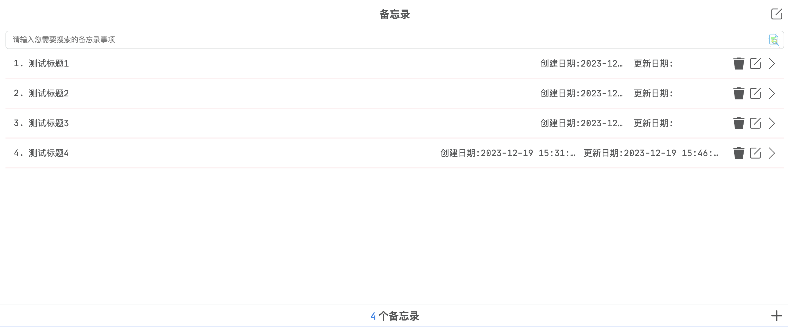
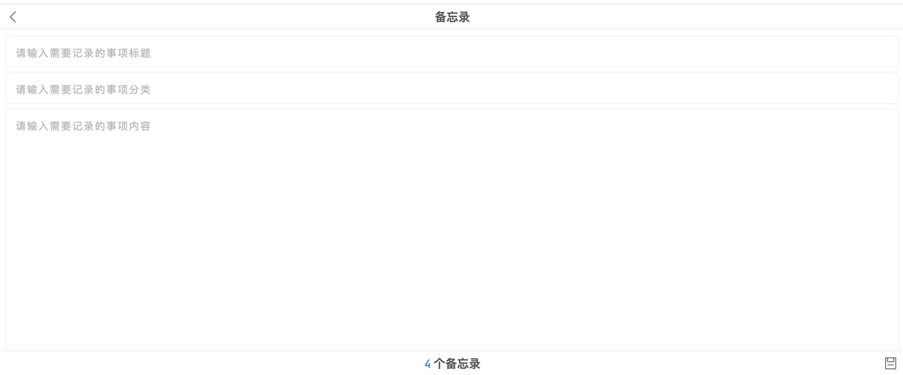
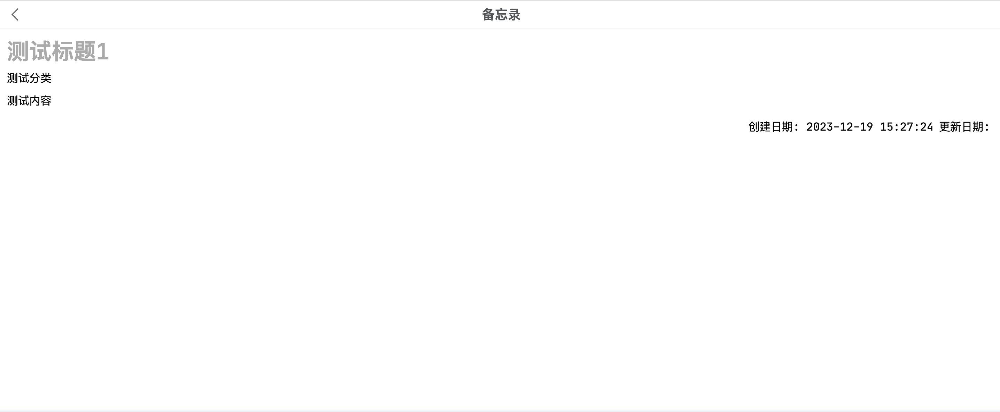
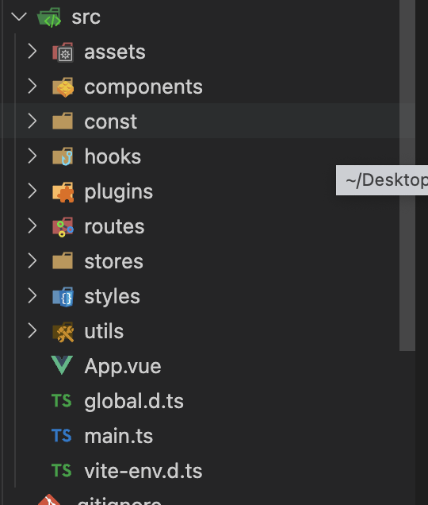

# vue3.js 实战--备忘录的实现

最近没有学到什么好的技术知识点分享，不过本次给大家带来一个实战，那就是使用 vue.js3 + ts 完成了一个小小的备忘录。虽然每个人的手机都自带有备忘录，但我更倾向于自己写一个备忘录，自己记笔记用，好了废话不多说，咱们开始吧。

## 备忘录的设计

既然是制作一个 web 版本的备忘录，那肯定也是要好好设计一番的，备忘录主要包含三个页面，如下:

1. 笔记展示页。
2. 笔记新增/编辑页。
3. 笔记详情页。

其中展示页如下图所示:



从上图我们可以知道展示页包含标题和中间笔记内容展示以及底部展示由几个备忘录和相关操作。

新增编辑页如下图所示:



从上图，我们可以看到新增编辑页就只是变更了中间的笔记展示内容为新增/编辑表单，然后底部操作按钮变更为保存按钮。

笔记详情页如下图所示:



详情页更简单，其实就是简单的展示即可。

也可以在线[访问]()该备忘录。

虽然以上的页面看起来都比较简单，但其实包含了很多逻辑，下面让我一一娓娓道来。

## 技术知识点

本次备忘录我们用到了如下技术栈:

1. vue3.js 基础语法以及状态管理工具 pinia 还有 vue 路由。
2. 使用 localforage 来存储管理笔记数据（后期也可以改造成后端接口）。
3. 封装了一个弹出框插件，以及使用到了自己写的消息提示框插件 [ew-message](https://github.com/eveningwater/ew-message)。
4. vite 搭建工程。

另外我们约定了笔记的数据结构，如下所示:

```ts
interface NoteDataItem extends NoteFormDataItem {
  id?: string;
  createDate?: string;
  updateDate?: string;
}

interface NoteFormDataItem {
  classification?: string;
  content?: string;
  title?: string;
}
```

这里可以讲解一下每个属性的含义，首先是 id 属性，这个不需多说，我们使用 uuid 来作为 id 属性值，其它如 title 则为笔记标题，content 则为笔记内容，classification 则为笔记分类,createDate 则为创建日期，updateDate 则为更新日期。

事实上 content 属性值我们还是有很大的改造空间的，因为我们的笔记应该不止有文本内容，还有图片链接，等等，但是这里我们只是考虑存储文本内容。

接下来我们来看下源码目录结构如下图所示:



可以看到我们的源码目录结构也很清晰，分析如下:

1. 首先是 components 目录，这里主要放置我们封装的备忘录用到的组件。
2. const 目录用来定义一些常量，比如我们这里用到了 iconfont 的很多图标，就定义在这个目录下。
3. 然后就是 hooks 钩子函数目录。
4. plugins 目录代表插件,这里主要是封装的弹出框插件。
5. routes 目录，vue 路由目录。
6. stores 目录，vue 状态管理数据。
7. styles 目录，样式。
8. utils 目录，工具函数。

可以这么说，虽然这只是一个小小的实战项目，但其实已经囊括了 vue 项目的基本，一个大型项目的基本骨架也就是这样慢慢从零到一累计起来的，只要掌握了本实战项目，那你的 vue.js 框架已经算是熟练使用呢。

根据实际效果，我们可以知道，整个备忘录其实整体变动不大，主要都是一些核心的小组件进行变动，比如新增编辑页面就主要变更图标还有中间内容区，再比如点击编辑多选删除的时候，也只是为数据增加一个多选框,因此，我们会在 app.vue 也就是根组件文件中定义一个 mainType 变量，用来确认当前是处于何种操作状态，并且我们还要将这种状态存储到会话存储中，以防止页面刷新时导致状态判断相关组件的显隐失效从而出现一些展示问题。

## 初始化项目

初始化项目很简单，其实按照官方[vite](https://vitejs.dev/guide/)文档上的说明即可初始化成功，这里不需要多说，然后我们需要安装相关依赖。如下所示:

```shell
pnpm  ew-message localforage pinia vue-router --save-dev
```

安装好我们需要的依赖之后，接下来按照我们最终实现的源码格式，我们删掉 app.vue 里面的一些示例代码，以及 components 目录下的 helloworld.vue 文件，新增 const,stores,routes,plugins,hooks，utils,styles 等目录。在 app.vue 同目录下新建一个 global.d.ts 用来定义备忘录笔记数据结构，如下所示:

```ts
// global.d.ts
interface NoteDataItem extends NoteFormDataItem {
  id?: string;
  createDate?: string;
  updateDate?: string;
}

interface NoteFormDataItem {
  classification?: string;
  content?: string;
  title?: string;
}
```

需要注意的就是这里我们为什么要区分出 NoteFormDataItem 和 NoteDataItem，这也是区分新增和编辑表单数据与最终展示的数据的结构，新增/编辑表单数据我们只需要核心的三个数据即可。

> ps: 当然，这里其实我们还可以设计一个状态字段，用于判断该备忘录是否已经完成，不过这属于后续扩展，这里暂时不讲解。

接下来，我们先来定义路由并挂载到 vue 根实例上，在 routes 目录下新建一个 route.ts，里面写上如下代码:

```ts
import { createRouter, createWebHashHistory } from 'vue-router';
const routes = [
  {
    path: '/',
    name: 'index',
    component: () => import('../components/List/List.vue')
  },
  {
    path: '/detail/:uuid',
    name: 'detail',
    component: () => import('../components/Detail/Detail.vue')
  },
  {
    path: '/*',
    name: 'error',
    component: () => import('../components/Error/Error.vue')
  }
];
const router = createRouter({
  history: createWebHashHistory(),
  routes
});

router.beforeEach((to, _, next) => {
  if (to.matched.length === 0) {
    // 没有匹配到路由则跳转到404页面
    next({ name: 'error' });
  } else {
    next(); // 正常跳转到相应路由
  }
});

export default router;
```

这里可以解释一下，我们使用 createRouter 方法创建一个路由，这里采用的是 hash 模式而非 history 模式，同理我们定义了一个 routs 路由数组，路由数组包含了是哪个路由配置对象，分别是 path 定义路由路径，name 定义路由名字，component 用于渲染相关组件，这里包含了 3 个组件，列表组件 List，详情组件 Detail 和错误组件 Error,写上这三个组件导入的代码的同时，我们可以在 components 目录下新建这三个组件，然后我们写了一个路由导航守卫方法，在方法里根据 matched.length 属性从而判断是否匹配到相关路由，如果没有匹配到，就跳转到 404 页面，否则即正常跳转，这里的 next 方法是 beforeEach 暴露出来的参数，具体用法可以参考[vue-router 官方文档](https://router.vuejs.org/)。

在 main.ts 中，我们改造一下代码，如下所示:

```ts
import { createApp } from 'vue';
import { createPinia } from 'pinia';
import './styles/variable.css';
import './styles/common.css';
import App from './App.vue';
import router from './routes/route';

const pinia = createPinia();
const app = createApp(App);
app.use(router);
app.use(pinia).mount('#app');
```

可以看到，我们使用 app.use 方法将 pinia 和 router 都挂载到了根实例上，然后我们导入了两个样式文件 common.css 和 variable.css，这两个文件我们将创建在 styles 目录下。

由于备忘录整体样式比较简单，基本上没有什么可以多讲的知识点，唯一需要说明的就是这里的输入框元素，我们是通过 div 元素模拟的，并且我们通过 attr 属性成功将元素的 placeholder 属性的内容值渲染到标签元素中。css 样式代码如下所示:

```css
.ew-note-textarea:focus,
.ew-note-textarea:focus::before,
.ew-note-textarea:not(:empty):before,
.ew-note-input:focus,
.ew-note-input:focus::before,
.ew-note-input:not(:empty):before {
  content: '';
}

.ew-note-textarea::before,
.ew-note-input::before {
  content: attr(placeholder);
  display: block;
  color: var(--mainTextareaPlaceholderColor--);
  letter-spacing: 2px;
}
```

其它都是一些基础样式没什么好说的，感兴趣的可以参考[源码]()。

接下来，我们需要创建 2 个状态，第一个就是新增备忘录时用到的表单数据，而第二个则是我们选中数据时存储的 id 数组，这里由于组件嵌套太深，因此我们使用状态管理工具来管理表单数据和选中数据存储的 ID 数组（这个数据主要用来批量删除备忘录数据的）。在 stores 目录下新建 checkedStore.ts 和 noteStore.ts,里面的代码分别如下所示:

```ts
// checkedStore.ts
import { defineStore } from 'pinia';
export const useCheckedStore = defineStore('noteCheckedData', {
  state: () => {
    return {
      checkedData: [] as string[]
    };
  }
});
```

```ts
// noteStore.ts
import { defineStore } from 'pinia';
import { updateFormKeys } from '../const/keys';

export const useNoteStore = defineStore('noteFormData', {
  state: () => {
    return {
      title: '',
      classification: '',
      content: ''
    };
  },
  actions: {
    clear() {
      updateFormKeys.forEach(key => {
        this[key as keyof NoteFormDataItem] = '';
      });
    }
  }
});
```

可以看到，我们使用 pinia 提供的 defineStore 方法定义 2 个状态，这个方法接受 2 个参数，第一个是数据 key，第二个则是数据配置对象，配置对象中可以配置 state 以及 actions，state 即状态，actions 即行为。这里我们还只是简单的使用 pinia 来定义状态，因为我们这样定义就足够了。值得注意的就是第二个 store 里面我们定义了一个 clear 方法，顾名思义就是清空数据状态值，这里引入了一个 updateFormKeys 属性数组。它在 const 目录下的 keys.ts 中定义，代码如下所示:

```ts
// keys.ts
export const updateFormKeys = ['title', 'classification', 'content'];
```

到这里为止，我们的基础项目核心就搭建好了，接下来，让我们一步一步对每个模块的代码进行分析。

## 工具函数模块

工具函数用到的也不多，主要分为以下几类:

1. 数据类型的判断。
2. 创建 uuid。
3. 回到顶部工具函数。
4. 时间日期格式化。
5. 操作类名工具函数。

接下来，我们就按照以上五个类别来逐一分析每一个工具函数。

### 数据类型的判断

首先是数据类型的判断，这里我们主要用到了是否是字符串，是否是布尔值以及是否是对象的数据类型，这里我们使用 typeof 操作符来判断数据类型，如下所示:

```ts
export const isString = <T>(value: T) => typeof value === 'string';
export const isBoolean = <T>(v: T) => typeof v === 'boolean';
export const isObject = <T>(v: T) => v && typeof v === 'object';
```

除此之外，还有一个判断是否是空对象的工具函数，很简单，首先判断是否是对象，然后使用 Object.keys 方法获取对象的属性，收集成为一个数组，然后判断数组的长度是否为 0 即可判断是否是空对象，代码如下所示:

```ts
export const isEmptyObject = <T>(v: T) =>
  isObject(v) && Object.keys(v as object).length === 0;
```

### 创建 uuid 工具函数

创建 uuid，我们使用 Math.random 函数取随机数，然后乘以一个几万或者几十万的数值，然后去截取，再与当前创建日期拼接起来,再拼接一个随机数，每一次拼接使用-来拼接起来，即可得到最终的 uuid，这样也能确保每次创建出来的 uuid 是唯一的。代码如下所示:

```ts
export const createUUID = () =>
  (Math.random() * 10000000).toString(16).substring(0, 4) +
  '-' +
  new Date().getTime() +
  '-' +
  Math.random().toString().substring(2, 5);
```

### 回到顶部工具函数

要实现回到顶部的逻辑，那么就需要监听事件，因此我们首先需要封装一个 on 方法，使用 element.addEventListener 来监听一个事件。代码如下所示:

```ts
export const on = (
  element: HTMLElement | Document | Element | Window,
  type: string,
  handler: EventListenerOrEventListenerObject,
  useCapture = false
) => {
  if (element && type && handler) {
    element.addEventListener(type, handler, useCapture);
  }
};
```

然后实现回到顶部的逻辑就是分两步，第一步就是页面滚动超出可见区域高度的时候，就出现回到顶部按钮否则就隐藏的逻辑，第二步则是点击回到顶部按钮修改滚动值为 0，这里采用定时器的方式使得滚动值是缓缓变成 0 的。基于这个思路，我们可以写出如下代码:

```ts
export const toTop = (top: HTMLElement, scrollEl?: HTMLElement) => {
  let scrollElement = scrollEl
      ? scrollEl
      : document.documentElement || document.body,
    timer: ReturnType<typeof setTimeout> | null = null,
    backTop = true;
  const onScrollHandler = () => {
    const oTop = scrollElement.scrollTop;
    // 可能有10px的偏差
    const clientHeight = Math.max(
      scrollElement?.scrollHeight - scrollElement.offsetHeight - 10,
      0
    );
    if (oTop > clientHeight) {
      top.style.visibility = 'visible';
    } else {
      top.style.visibility = 'hidden';
    }
    if (!backTop && timer) {
      clearTimeout(timer);
    }
    backTop = true;
  };
  const toTopHandler = () => {
    const oTop = scrollElement.scrollTop,
      speed = Math.floor(-oTop / 6);
    scrollElement.scrollTop = oTop + speed;
    if (oTop === 0) {
      timer && clearTimeout(timer);
      top.style.visibility = 'hidden';
      backTop = false;
    } else {
      timer = setTimeout(toTopHandler, 30);
    }
  };
  on(top, 'click', toTopHandler);
  on(scrollElement || window, 'scroll', onScrollHandler);
};
```

以上之所以创建一个 backTop 变量，是为了保证两个逻辑之间不起冲突。这个方法支持传入 2 个参数，第一个参数为回到顶部按钮元素，第二个参数则为滚动元素（也就是出现滚动条的元素）。这里由于我们实现的弹窗插件也用到了一些工具函数，会和这里重复，因此我们单独提取出来封装成了一个类，如下所示:

```ts
// baseUtils.ts
export default class ewWebsiteBaseUtils {
  eventType: string[];
  constructor() {
    this.eventType = this.isMobile()
      ? ['touchstart', 'touchmove', 'touchend']
      : ['mousedown', 'mousemove', 'mouseup'];
  }
  isMobile() {
    return !!navigator.userAgent.match(/(iPhone|iPod|Android|ios)/i);
  }
  $(selector: string, el: Document | HTMLElement = document) {
    return el.querySelector(selector);
  }
  $$(selector: string, el: Document | HTMLElement = document) {
    return el.querySelectorAll(selector);
  }

  getStyle(
    el: HTMLElement,
    selector: string | null | undefined = null,
    prop: string
  ) {
    const getComputedStyle = window.getComputedStyle || document.defaultView;
    return getComputedStyle(el, selector).getPropertyValue(prop);
  }
  hasClass(el: HTMLElement, className: string) {
    if (el.classList.contains) {
      return el.classList.contains(className);
    } else {
      const matchRegExp = new RegExp('(^|\\s)' + className + '(\\s|$)');
      return matchRegExp.test(el.className);
    }
  }
  handleClassName(className?: string, status?: boolean) {
    const condition = this.isBoolean(status)
      ? status
      : this.isString(className) && className;
    return condition ? ` ${className}` : '';
  }
  handleTemplate(isRender?: boolean, template?: string) {
    return this.isBoolean(isRender) &&
      isRender &&
      this.isString(template) &&
      template
      ? template
      : '';
  }

  isObject<T>(v: T) {
    return v && typeof v === 'object';
  }
  isString<T>(value: T) {
    return typeof value === 'string';
  }

  isBoolean<T>(v: T) {
    return typeof v === 'boolean';
  }

  on(
    element: HTMLElement | Document | Element | Window,
    type: string,
    handler: EventListenerOrEventListenerObject,
    useCapture = false
  ) {
    if (element && type && handler) {
      element.addEventListener(type, handler, useCapture);
    }
  }
  off(
    element: HTMLElement | Document | Element | Window,
    type: string,
    handler: EventListenerOrEventListenerObject,
    useCapture = false
  ) {
    if (element && type && handler) {
      element.removeEventListener(type, handler, useCapture);
    }
  }

  create(tagName: string) {
    return document.createElement(tagName);
  }
  createElement(str: string) {
    const element = this.create('div');
    element.innerHTML = str;
    return element.firstElementChild;
  }
  assign(target: Record<string, any>, ...args: Record<string, any>[]) {
    if (Object.assign) {
      return Object.assign(target, ...args);
    } else {
      if (target === null) {
        return;
      }
      const _ = Object(target);
      args.forEach(item => {
        if (this.isObject(item)) {
          for (let key in item) {
            if (Object.prototype.hasOwnProperty.call(item, key)) {
              _[key] = item[key];
            }
          }
        }
      });
      return _;
    }
  }
  addClass(el: HTMLElement, className: string) {
    return el.classList.add(className);
  }
  removeClass(el: HTMLElement, className: string) {
    return el.classList.remove(className);
  }
}
```

### 时间日期格式化

接下来我们就是封装一下时间日期的格式化，其实很简单，就是通过 Date 对象获取到年月日时分秒，然后改下格式即可，代码如下所示:

```ts
export const formatNumber = (n: number | string) => {
  n = n.toString();
  return n[1] ? n : '0' + n;
};
export const formatTime = (date: Date = new Date()) => {
  const year = date.getFullYear();
  const month = date.getMonth() + 1;
  const day = date.getDate();
  const hour = date.getHours();
  const minute = date.getMinutes();
  const second = date.getSeconds();
  return (
    [year, month, day].map(formatNumber).join('-') +
    ' ' +
    [hour, minute, second].map(formatNumber).join(':')
  );
};
```

这里有一个有意思的点，就是 formatNumber 函数当中如何确定是需要补零的呢？首先年份我们是不需要补零的，至于其它时间只有小于 10 的情况下才会补零，因此我们转成字符串，只需要判断如果第二个字符存在，代表大于 10 了，就不需要补零，否则才补零。

### 操作类名工具函数

操作类名函数，这个我主要用在了 svg 元素上，观察 const/icon.ts 中，我的图标是如此定义的，如下所示:

```ts
import { handleClassName } from '../utils/utils';
export const cancelIcon = (className?: string) =>
  `<svg t="1701689019983" class="cancel-icon${handleClassName(
    className
  )}" viewBox="0 0 1140 1024" version="1.1" xmlns="http://www.w3.org/2000/svg" p-id="9471" ><path d="M474.133828 76.681372c-261.931418 0-474.133828 212.297312-474.133828 474.133828 0 261.836515 212.20241 474.133828 474.133828 474.133828s474.133828-212.297312 474.133828-474.133828C948.267655 288.978684 735.970343 76.681372 474.133828 76.681372zM521.774977 637.271548 521.774977 521.774977c-57.321223 0-203.471362 1.328638-203.471362 158.487488 0 82.28063 55.80278 150.990176 130.016682 166.838925C329.217424 830.208712 237.066914 724.487118 237.066914 595.134754c0-240.293605 245.228545-242.286562 284.708063-242.286562L521.774977 254.529008l189.330862 192.08304L521.774977 637.271548z" p-id="9472"></path></svg>`;
export const emptyDataIcon = (className?: string) =>
  `<svg t="1690278699020" class="empty-data-icon${handleClassName(
    className
  )}" viewBox="0 0 1024 1024" version="1.1" xmlns="http://www.w3.org/2000/svg" p-id="3148"><path d="M102.4 896a409.6 51.2 0 1 0 819.2 0 409.6 51.2 0 1 0-819.2 0Z" opacity=".1" p-id="3149"></path><path d="M116.736 376.832c0 8.704 6.656 15.36 15.36 15.36s15.36-6.656 15.36-15.36-6.656-15.36-15.36-15.36c-8.192 0-15.36 7.168-15.36 15.36zM926.72 832c-19.456 5.12-23.552 9.216-28.16 28.16-5.12-19.456-9.216-23.552-28.16-28.16 18.944-5.12 23.552-9.216 28.16-28.16 4.608 18.944 8.704 23.552 28.16 28.16zM202.24 323.072c-25.088 6.656-30.208 11.776-36.864 36.864-6.656-25.088-11.776-30.208-36.864-36.864 25.088-6.656 30.208-12.288 36.864-36.864 6.144 25.088 11.776 30.208 36.864 36.864zM816.64 235.008c-15.36 4.096-18.432 7.168-22.528 22.528-4.096-15.36-7.168-18.432-22.528-22.528 15.36-4.096 18.432-7.168 22.528-22.528 3.584 15.36 7.168 18.432 22.528 22.528zM882.688 156.16c-39.936 10.24-48.128 18.944-58.88 58.88-10.24-39.936-18.944-48.128-58.88-58.88 39.936-10.24 48.128-18.944 58.88-58.88 10.24 39.424 18.944 48.128 58.88 58.88z" opacity=".5" p-id="3150"></path><path d="M419.84 713.216v4.096l33.792 31.232 129.536-62.976L465.92 760.832v36.864l18.944-18.432v-0.512 0.512l18.944 18.432 100.352-122.88v-4.096z" opacity=".2" p-id="3151"></path><path d="M860.16 551.936v-1.024c0-1.024-0.512-1.536-0.512-2.56v-0.512l-110.08-287.232c-15.872-48.64-60.928-81.408-112.128-81.408H387.072c-51.2 0-96.256 32.768-112.128 81.408L164.864 547.84v0.512c-0.512 1.024-0.512 1.536-0.512 2.56V757.76c0 65.024 52.736 117.76 117.76 117.76h460.8c65.024 0 117.76-52.736 117.76-117.76v-204.8c-0.512-0.512-0.512-0.512-0.512-1.024zM303.616 271.36s0-0.512 0.512-0.512C315.392 233.984 349.184 209.92 387.072 209.92h249.856c37.888 0 71.68 24.064 83.456 60.416 0 0 0 0.512 0.512 0.512l101.888 266.24H588.8c-8.704 0-15.36 6.656-15.36 15.36 0 33.792-27.648 61.44-61.44 61.44s-61.44-27.648-61.44-61.44c0-8.704-6.656-15.36-15.36-15.36H201.728L303.616 271.36zM829.44 757.76c0 48.128-38.912 87.04-87.04 87.04H281.6c-48.128 0-87.04-38.912-87.04-87.04v-189.44h226.816c7.168 43.52 45.056 76.8 90.624 76.8s83.456-33.28 90.624-76.8H829.44v189.44z" opacity=".5" p-id="3152"></path><path d="M512 578.56c-14.336 0-25.6-11.264-25.6-25.6V501.76H253.44l83.968-219.136 0.512-1.024c7.168-21.504 26.624-35.84 49.152-35.84h249.856c22.528 0 41.984 14.336 49.152 35.84l0.512 1.024L770.56 501.76H537.6v51.2c0 14.336-11.264 25.6-25.6 25.6z" opacity=".2" p-id="3153"></path></svg>`;
export const addIcon = (className?: string) =>
  `<svg t="1697700092492" class="add-icon${handleClassName(
    className
  )}" viewBox="0 0 1024 1024" version="1.1" xmlns="http://www.w3.org/2000/svg" p-id="900" ><path d="M560.064 149.952a48 48 0 0 0-96 0V464H150.016a48 48 0 0 0 0 96H464v313.984a48 48 0 0 0 96 0V560h314.048a48 48 0 0 0 0-96H560V149.952z" p-id="901"></path></svg>`;
export const closeIcon = (className?: string) =>
  `<svg t="1690189203554" class="close-icon${handleClassName(
    className
  )}" viewBox="0 0 1024 1024" version="1.1" xmlns="http://www.w3.org/2000/svg" p-id="2272"><path d="M504.224 470.288l207.84-207.84a16 16 0 0 1 22.608 0l11.328 11.328a16 16 0 0 1 0 22.624l-207.84 207.824 207.84 207.84a16 16 0 0 1 0 22.608l-11.328 11.328a16 16 0 0 1-22.624 0l-207.824-207.84-207.84 207.84a16 16 0 0 1-22.608 0l-11.328-11.328a16 16 0 0 1 0-22.624l207.84-207.824-207.84-207.84a16 16 0 0 1 0-22.608l11.328-11.328a16 16 0 0 1 22.624 0l207.824 207.84z" p-id="2273"></path></svg>`;
export const checkedIcon = (className?: string) =>
  `<svg t="1702382629512" class="checked-icon${handleClassName(
    className
  )}" viewBox="0 0 1024 1024" version="1.1" xmlns="http://www.w3.org/2000/svg" p-id="2321" ><path d="M969.6 208c-9.6-9.6-25.6-9.6-35.2 0l-508.8 537.6c-19.2 19.2-48 19.2-70.4 3.2l-265.6-252.8c-9.6-9.6-25.6-9.6-35.2 0-9.6 9.6-9.6 25.6 0 35.2l265.6 252.8c38.4 38.4 102.4 35.2 137.6-3.2l508.8-537.6C979.2 233.6 979.2 217.6 969.6 208z" p-id="2322"></path></svg>`;
export const editIcon = (className?: string) =>
  `<svg t="1702451742331" class="edit-icon${handleClassName(
    className
  )}" viewBox="0 0 1024 1024" version="1.1" xmlns="http://www.w3.org/2000/svg" p-id="3330"><path d="M862.709333 116.042667a32 32 0 1 1 45.248 45.248L455.445333 613.813333a32 32 0 1 1-45.258666-45.258666L862.709333 116.053333zM853.333333 448a32 32 0 0 1 64 0v352c0 64.8-52.533333 117.333333-117.333333 117.333333H224c-64.8 0-117.333333-52.533333-117.333333-117.333333V224c0-64.8 52.533333-117.333333 117.333333-117.333333h341.333333a32 32 0 0 1 0 64H224a53.333333 53.333333 0 0 0-53.333333 53.333333v576a53.333333 53.333333 0 0 0 53.333333 53.333333h576a53.333333 53.333333 0 0 0 53.333333-53.333333V448z" p-id="3331"></path></svg>`;
export const deleteIcon = (className?: string) =>
  `<svg t="1702452402229" class="delete-icon${handleClassName(
    className
  )}" viewBox="0 0 1024 1024" version="1.1" xmlns="http://www.w3.org/2000/svg" p-id="4351" ><path d="M96 128h832v64H96zM128 256h768l-89.024 704H217.024z" p-id="4352"></path><path d="M384 64h256v96h-256z" p-id="4353"></path></svg>`;
export const backIcon = (className?: string) =>
  `<svg t="1702455221301" class="back-icon${handleClassName(
    className
  )}" viewBox="0 0 1024 1024" version="1.1" xmlns="http://www.w3.org/2000/svg" p-id="5323" ><path d="M624.788992 204.047974 585.205965 164.464026 219.560038 530.185011 585.205965 895.864013 624.788992 856.280986 298.663014 530.16105Z" p-id="5324"></path></svg>`;
export const arrowRightIcon = (className?: string) =>
  `<svg t="1702456062203" class="arrow-right-icon${handleClassName(
    className
  )}" viewBox="0 0 1024 1024" version="1.1" xmlns="http://www.w3.org/2000/svg" p-id="5477"><path d="M289.301454 938.361551c8.958022 8.93551 24.607444 7.868201 34.877345-2.312672l405.886217-403.662573c5.846148-5.780657 8.581446-13.271258 8.314363-20.306488 0.331551-7.080256-2.423189-14.637372-8.270361-20.463054L324.178799 87.966471c-10.269901-10.225899-25.875321-11.248182-34.877345-2.322905-8.960069 8.946766-7.936763 24.451902 2.334161 34.666544l393.880789 391.68068L291.635615 903.68375C281.364691 913.908626 280.341385 929.423995 289.301454 938.361551z" p-id="5478"></path></svg>`;
export const saveIcon = (className?: string) =>
  `<svg t="1702465877637" class="save-icon${handleClassName(
    className
  )}" viewBox="0 0 1024 1024" version="1.1" xmlns="http://www.w3.org/2000/svg" p-id="6475"><path d="M814.805 128a51.179 51.179 0 0 1 51.179 51.179V844.01a51.179 51.179 0 0 1-51.179 51.157H201.173a51.179 51.179 0 0 1-51.178-51.157V179.179A51.179 51.179 0 0 1 201.173 128h613.654zM329.024 434.837a51.093 51.093 0 0 1-51.179-51.093V179.157h-76.672v664.854h613.76V179.179H738.22v204.48a51.179 51.179 0 0 1-51.179 51.178H329.024z m0-51.093h357.995V179.157H329.024v204.587z m357.91 204.501a25.557 25.557 0 1 1 0.085 51.072H329.024a25.536 25.536 0 1 1 0-51.072h357.91z" p-id="6476"></path></svg>`;
export const errorIcon = (className?: string) =>
  `<svg t="1702887842356" class="error-icon${handleClassName(
    className
  )}" viewBox="0 0 1024 1024" version="1.1" xmlns="http://www.w3.org/2000/svg" p-id="2350"><path d="M931.6 585.6v79c28.6-60.2 44.8-127.4 44.8-198.4C976.4 211 769.4 4 514.2 4S52 211 52 466.2c0 3.2 0.2 6.4 0.2 9.6l166-206h96.4L171.8 485.6h46.4v-54.8l99.2-154.6V668h-99.2v-82.4H67.6c43 161 170.6 287.4 332.4 328.6-10.4 26.2-40.6 89.4-90.8 100.6-62.2 14 168.8 3.4 333.6-104.6C769.4 873.6 873.6 784.4 930.2 668h-97.6v-82.4H666.4V476l166.2-206.2h94L786.2 485.6h46.4v-59l99.2-154v313zM366.2 608c-4.8-11.2-7.2-23.2-7.2-36V357.6c0-12.8 2.4-24.8 7.2-36 4.8-11.2 11.4-21 19.6-29.2 8.2-8.2 18-14.8 29.2-19.6 11.2-4.8 23.2-7.2 36-7.2h81.6c12.8 0 24.8 2.4 36 7.2 11 4.8 20.6 11.2 28.8 19.2l-88.6 129.4v-23c0-4.8-1.6-8.8-4.8-12-3.2-3.2-7.2-4.8-12-4.8s-8.8 1.6-12 4.8c-3.2 3.2-4.8 7.2-4.8 12v72L372.6 620c-2.4-3.8-4.6-7.8-6.4-12z m258.2-36c0 12.8-2.4 24.8-7.2 36-4.8 11.2-11.4 21-19.6 29.2-8.2 8.2-18 14.8-29.2 19.6-11.2 4.8-23.2 7.2-36 7.2h-81.6c-12.8 0-24.8-2.4-36-7.2-11.2-4.8-21-11.4-29.2-19.6-3.6-3.6-7-7.8-10-12l99.2-144.6v50.6c0 4.8 1.6 8.8 4.8 12 3.2 3.2 7.2 4.8 12 4.8s8.8-1.6 12-4.8c3.2-3.2 4.8-7.2 4.8-12v-99.6L601 296.4c6.6 7.4 12 15.8 16 25.2 4.8 11.2 7.2 23.2 7.2 36V572z"  p-id="2351"></path></svg>`;
export const searchIcon = (className?: string) =>
  `<svg t="1702966824556" class="search-icon${handleClassName(
    className
  )}" viewBox="0 0 1024 1024" version="1.1" xmlns="http://www.w3.org/2000/svg" p-id="3880"><path d="M624 293.92h114.96v461.04a48 48 0 0 1-48 48H244.36a48 48 0 0 1-48-48v-576a48 48 0 0 1 48-48h332v114.96a48 48 0 0 0 47.64 48z" fill="#CBECF9" p-id="3881"></path><path d="M624 293.92h114.96v410.76a48 48 0 0 1-48 48H244.36a48 48 0 0 1-48-48V178.96a48 48 0 0 1 48-48h332v114.96a48 48 0 0 0 47.64 48z" fill="#FFFFFF" p-id="3882"></path><path d="M651.04 316.88m0 28.16l0 0.04q0 28.16-28.16 28.16l-310.24 0q-28.16 0-28.16-28.16l0-0.04q0-28.16 28.16-28.16l310.24 0q28.16 0 28.16 28.16Z" fill="#90FC95" p-id="3883"></path><path d="M526.52 398.16m0 28.16l0 0.04q0 28.16-28.16 28.16l-185.72 0q-28.16 0-28.16-28.16l0-0.04q0-28.16 28.16-28.16l185.72 0q28.16 0 28.16 28.16Z" fill="#90FC95" p-id="3884"></path><path d="M480.04 479.44m0 28.16l0 0.04q0 28.16-28.16 28.16l-139.24 0q-28.16 0-28.16-28.16l0-0.04q0-28.16 28.16-28.16l139.24 0q28.16 0 28.16 28.16Z" fill="#90FC95" p-id="3885"></path><path d="M615.16 560.72m0 28.16l0 0.04q0 28.16-28.16 28.16l-274.36 0q-28.16 0-28.16-28.16l0-0.04q0-28.16 28.16-28.16l274.36 0q28.16 0 28.16 28.16Z" fill="#90FC95" p-id="3886"></path><path d="M739.16 325.6H624a48 48 0 0 1-48-48V162.64l162.96 131.28z" fill="#CBECF9" p-id="3887"></path><path d="M691.16 810.96H244.36a56 56 0 0 1-56-56v-576a56 56 0 0 1 56-56h332a8 8 0 0 1 8 8v114.96a40 40 0 0 0 40 40h114.96a8 8 0 0 1 8 8v461.04a56 56 0 0 1-56.16 56z m-446.8-672a40 40 0 0 0-40 40v576a40 40 0 0 0 40 40h446.8a40 40 0 0 0 40-40V301.92H624a56 56 0 0 1-56-56V138.96z" fill="#2FB1EA" p-id="3888"></path><path d="M739.16 293.92H624a48 48 0 0 1-48-48V130.96z" fill="#E5F5FC" p-id="3889"></path><path d="M739.16 301.92H624a56 56 0 0 1-56-56V130.96a8 8 0 0 1 13.64-5.64l163.16 162.96a8 8 0 0 1-5.64 13.64zM584 150.28v95.64a40 40 0 0 0 40 40h96zM794.68 894L628.72 728a24 24 0 0 1 33.96-33.96L828.64 860a24 24 0 0 1-33.96 33.96z" fill="#2FB1EA" p-id="3890"></path><path d="M689.92 721.36l-27.28-27.28a24 24 0 0 0-33.96 33.96l27.28 27.28a209.76 209.76 0 0 0 33.96-33.96z" fill="#1A96E2" p-id="3891"></path><path d="M526.96 592.32m-168 0a168 168 0 1 0 336 0 168 168 0 1 0-336 0Z" fill="#FFC444" p-id="3892"></path><path d="M526.96 579.08m-154.76 0a154.76 154.76 0 1 0 309.52 0 154.76 154.76 0 1 0-309.52 0Z" fill="#FFE76E" p-id="3893"></path><path d="M526.96 768.32a176 176 0 1 1 176-176 176 176 0 0 1-176 176z m0-336a160 160 0 1 0 160 160 160 160 0 0 0-160-160z" fill="#2FB1EA" p-id="3894"></path><path d="M526.96 582m-131.48 0a131.48 131.48 0 1 0 262.96 0 131.48 131.48 0 1 0-262.96 0Z" fill="#FFC444" p-id="3895"></path><path d="M526.96 592.32m-121.16 0a121.16 121.16 0 1 0 242.32 0 121.16 121.16 0 1 0-242.32 0Z" fill="#FFFFFF" p-id="3896"></path><path d="M484.2 509.4a37.56 37.56 0 0 0-10.4-25.96 121.56 121.56 0 0 0-59.24 63.72h32a37.72 37.72 0 0 0 37.64-37.76zM648 586.64a37.52 37.52 0 0 0-20.56-6.12h-221.08c-0.36 4-0.56 8-0.56 11.8A120.56 120.56 0 0 0 424 656H630.2a120.56 120.56 0 0 0 18-63.56c-0.2-2.04-0.2-3.92-0.2-5.8z" fill="#90FC95" p-id="3897"></path><path d="M526.96 721.48A129.16 129.16 0 1 1 656 592.32a129.28 129.28 0 0 1-129.04 129.16z m0-242.32A113.16 113.16 0 1 0 640 592.32a113.28 113.28 0 0 0-113.04-113.16z" fill="#2FB1EA" p-id="3898"></path><path d="M776 176m-20 0a20 20 0 1 0 40 0 20 20 0 1 0-40 0Z" fill="#D4FFD4" p-id="3899"></path><path d="M156 568m-16 0a16 16 0 1 0 32 0 16 16 0 1 0-32 0Z" fill="#D4FFD4" p-id="3900"></path><path d="M132 188m-12 0a12 12 0 1 0 24 0 12 12 0 1 0-24 0Z" fill="#D4FFD4" p-id="3901"></path><path d="M808 428m-8 0a8 8 0 1 0 16 0 8 8 0 1 0-16 0Z" fill="#D4FFD4" p-id="3902"></path><path d="M916 908m-4 0a4 4 0 1 0 8 0 4 4 0 1 0-8 0Z" fill="#D4FFD4" p-id="3903"></path><path d="M860 996m-20 0a20 20 0 1 0 40 0 20 20 0 1 0-40 0Z" fill="#FFBDBD" p-id="3904"></path><path d="M828 716m-16 0a16 16 0 1 0 32 0 16 16 0 1 0-32 0Z" fill="#FFBDBD" p-id="3905"></path><path d="M272 948m-12 0a12 12 0 1 0 24 0 12 12 0 1 0-24 0Z" fill="#FFBDBD" p-id="3906"></path><path d="M824 72m-8 0a8 8 0 1 0 16 0 8 8 0 1 0-16 0Z" fill="#FFBDBD" p-id="3907"></path><path d="M440 76m-4 0a4 4 0 1 0 8 0 4 4 0 1 0-8 0Z" fill="#FFBDBD" p-id="3908"></path><path d="M112 420m-20 0a20 20 0 1 0 40 0 20 20 0 1 0-40 0Z" fill="#BBF1FF" p-id="3909"></path><path d="M472 976m-16 0a16 16 0 1 0 32 0 16 16 0 1 0-32 0Z" fill="#BBF1FF" p-id="3910"></path><path d="M860 500m-12 0a12 12 0 1 0 24 0 12 12 0 1 0-24 0Z" fill="#BBF1FF" p-id="3911"></path><path d="M800 320m-8 0a8 8 0 1 0 16 0 8 8 0 1 0-16 0Z" fill="#BBF1FF" p-id="3912"></path><path d="M124 852m-4 0a4 4 0 1 0 8 0 4 4 0 1 0-8 0Z" fill="#BBF1FF" p-id="3913"></path><path d="M228 28m-20 0a20 20 0 1 0 40 0 20 20 0 1 0-40 0Z" fill="#FFF4C5" p-id="3914"></path><path d="M680 84m-16 0a16 16 0 1 0 32 0 16 16 0 1 0-32 0Z" fill="#FFF4C5" p-id="3915"></path><path d="M132 704m-12 0a12 12 0 1 0 24 0 12 12 0 1 0-24 0Z" fill="#FFF4C5" p-id="3916"></path><path d="M176 320m-8 0a8 8 0 1 0 16 0 8 8 0 1 0-16 0Z" fill="#FFF4C5" p-id="3917"></path><path d="M928 632m-4 0a4 4 0 1 0 8 0 4 4 0 1 0-8 0Z" fill="#FFF4C5" p-id="3918"></path></svg>`;
```

这也就促使了这个工具函数的诞生，那就是如果传入了类名，则需要空格区分添加进去，否则就返回空字符串，不添加即可，至于为什么要有第二个参数，那是因为在弹出框插件当中，如果是动态插入模板字符串，需要修改类名，那么就可能需要第二个布尔值。

通过以上分析，我们也就明白了这个工具函数的定义，如下所示:

```ts
export const handleClassName = (
  className?: string,
  status?: boolean
): string => {
  const condition = this.isBoolean(status)
    ? status
    : this.isString(className) && className;
  return condition ? ` ${className}` : '';
};
```

## 插件目录

弹出框插件的实现，不打算细讲，感兴趣的可以查看[源码]()。

## hooks 目录

hooks 主要封装了 2 个函数，第一个就是存储数据，第二个则是获取存储数据，代码如下所示:

```ts
import localforage from 'localforage';

export const useMemoData = async () => {
  let memoStoreCacheData: string =
    (await localforage.getItem<string>('memoData')) || '';
  let memoStoreData: Array<NoteDataItem> = [];
  try {
    memoStoreData = JSON.parse(memoStoreCacheData);
  } catch (error) {
    memoStoreData = [];
  }
  return memoStoreData;
};

export const useSetMemoData = async (
  data: Array<NoteDataItem>,
  isGetCache = true
) => {
  let memoStoreCacheData = isGetCache ? await useMemoData() : [];
  let memoStoreData: Array<NoteDataItem> = [...memoStoreCacheData, ...data];
  localforage.setItem('memoData', JSON.stringify(memoStoreData));
};
```

这两个 hooks 我们将在组件当中经常用到，也就是新增，编辑，删除备忘录的时候都会用到，这两个 hooks 函数的逻辑也好理解，第一个就是通过 getItem 方法获取到字符串数据然后通过 JSON.parse 解析成数组，而第二个则是实用 JSON.stringify 方法将数组转成字符串然后调用 setItem 存储。

接下来，就是各个组件的实现了。

## 组件模块

组件模块的所有代码都是很相似的，知识点也基本都是事件传递，单向数据流，监听数据等等。因此我们只需要通过分析一个根组件的源代码，基本就可以按照相同方式去理解其它组件。

### 根组件 app.vue

在根组件当中，我们可以看到，我们将页面拆分成了 3 个部分，即头部 header,中间内容 main 以及底部 footer。如下所示:

```vue
<!-- template部分 -->
<async-header
  :mainType="mainType"
  @on-back="onBackHandler"
  :memoData="memoData"
  @on-header-click="onHeaderClickHandler"
></async-header>
<async-main
  :mainType="mainType"
  :memo-data="memoData"
  @on-delete="getMemoData"
  @on-detail="onDetailHandler"
  @on-edit="onEditHandler"
  :editData="editData"
  :showCheckBox="showCheckBox"
  @on-search="onSearchHandler"
></async-main>
<async-footer
  @on-footer-click="onFooterClick"
  :mainType="mainType"
  v-if="mainType !== 'detail'"
  :totalNote="memoData.length"
  :editData="editData"
></async-footer>
```

其中 mainType 就是我们前面讲过的用来确定当前页面属于哪一模块，具体的值，我们定义有 add,save,detail，然后 memoData 就是我们的数据，editData 则是我们的编辑数据，它应该是一个对象，totalNote 就是总共有多少条备忘录，showCheckBox 表示是否显示多选框从而触发多选删除操作。其它就是一些事件，比如 on-back 就是点击返回按钮所执行的逻辑，on-delete 就是点击单个备忘录删除的逻辑，on-detail 点击跳转到备忘录详情的逻辑，on-edit 表示点击编辑单个备忘录的的逻辑，on-search 则是点击搜索的逻辑。

然后可以看下我们的 ts 逻辑，代码如下所示:

```vue
<script setup lang="ts">
import { defineAsyncComponent, ref, onMounted } from 'vue';
import { useRouter, useRoute } from 'vue-router';
import { useMemoData, useSetMemoData } from './hooks/useMemoData';
import { useCheckedStore } from './stores/checkedStore';
import ewMessage from 'ew-message';
import localforage from 'localforage';
import { ewConfirm } from './plugins/ewPopbox';
const AsyncHeader = defineAsyncComponent(
  () => import('./components/Header/Header.vue')
);
const AsyncMain = defineAsyncComponent(
  () => import('./components/Main/Main.vue')
);
const AsyncFooter = defineAsyncComponent(
  () => import('./components/Footer/Footer.vue')
);
const mainType = ref<string>('add');
const editData = ref<NoteDataItem>({});
const memoData = ref<NoteDataItem[]>([]);
const searchCacheMemoData = ref<NoteDataItem[]>([]);
const showCheckBox = ref(false);
const router = useRouter();
const route = useRoute();
const checkedStore = useCheckedStore();
const getMemoData = async () => {
  const memoStoreData = (await useMemoData()) || [];
  memoData.value = [...memoStoreData];
  searchCacheMemoData.value = memoData.value;
  const type = await localforage.getItem<string>('mainType');
  if (type) {
    mainType.value = type;
  }
  // 如果当前处于选中待删除状态，刷新页面后重置回未选中待删除状态
  if (type === 'delete') {
    mainType.value = 'add';
  }
};
const onBackHandler = () => {
  mainType.value = 'add';
  localforage.setItem('mainType', mainType.value);
  if (route.name === 'detail') {
    router.push({
      name: 'index'
    });
    showCheckBox.value = false;
    getMemoData();
  }
};
const onHeaderClickHandler = (v: string) => {
  const isCancel = v === 'cancel';
  showCheckBox.value = isCancel;
  mainType.value = isCancel ? 'delete' : 'add';
};
const onFooterClick = async (v: string, isClearEditData: boolean) => {
  if (v === 'editRefresh') {
    mainType.value = 'add';
  }
  if (v !== 'addRefresh') {
    mainType.value = v;
  }
  // 点击新增需要清空编辑数据
  if (isClearEditData) {
    editData.value = {};
  }
  // 新增或者编辑成功后都需要刷新列表
  if (v.toLowerCase().includes('refresh')) {
    getMemoData();
  }
  if (v === 'delete') {
    if (checkedStore.checkedData.length === 0) {
      return ewMessage.warning({
        content: '请选择需要删除的备忘录事项',
        duration: 4000
      });
    }
    ewConfirm({
      title: '温馨提示',
      content: '确定要删除这些备忘录事项吗?',
      showCancel: true,
      sure: async (ctx, e) => {
        e?.stopImmediatePropagation();
        searchCacheMemoData.value = memoData.value =
          searchCacheMemoData.value.filter(
            item => !checkedStore.checkedData.includes(item.id!)
          );
        if (memoData.value.length === 0) {
          mainType.value = 'add';
        }
        await useSetMemoData(memoData.value, false);
        // 删除完成需要清空
        checkedStore.$patch({ checkedData: [] });
        ewMessage.success({
          content: '删除成功',
          duration: 4000
        });
        ctx?.close(600);
        setTimeout(() => getMemoData(), 10);
      }
    });
  }
  localforage.setItem('mainType', mainType.value);
};

const onEditHandler = (id: string) => {
  mainType.value = 'save';
  editData.value = memoData.value.find(item => item.id === id) || {};
};

const onDetailHandler = () => {
  mainType.value = 'detail';
  localforage.setItem('mainType', mainType.value);
};

const onSearchHandler = (v: string) => {
  // if (!v) {
  //     return ewMessage.warning({
  //         content: "请输入需要搜素的内容",
  //         duration: 4000
  //     })
  // }
  const searchMemoData = searchCacheMemoData.value.filter(
    item =>
      item.content?.includes(v) ||
      item.title?.includes(v) ||
      item.classification?.includes(v)
  );
  memoData.value = searchMemoData;
};
onMounted(async () => {
  getMemoData();
});
</script>
```

接下来我们对以上代码逐一分析，总结下来就三步，第一步导入相关依赖或工具函数，第二步定义相关数据状态，第三步添加事件逻辑。

首先我们使用 defineAsyncComponent 这个方法来异步加载组件，这样做的好处就是懒加载组件，尽可能减少首页的渲染。然后我们会用一个 searchCacheMemoData 来缓存数据，因为我们的搜索功能需要基于缓存的数据来进行替换。然后还需要注意的就是，在多选删除或者删除数据之后，我们的缓存的数据也需要更换。其余的像 memoData,editData 等在前面我们也已经介绍过了，然后我们定义了一个 getMemoData 方法，这个方法就是获取备忘录数据的，我们通过 useMemoData 封装好的 hooks 函数来获取数据，然后在 onMounted 钩子函数中调用一次。

然后我们还需要缓存 mainType，这样能保证如果页面刷新后，当前页面所处于哪一种状态不会出现任何问题。接下来就是每一个事件的逻辑，比如 onBackHandler，在新增/编辑/详情页时会出现该按钮，点击该按钮我们就会返回到首页，如果是新增/编辑页点击返回，我们只需要修改 mainType 即可，而如果是详情页，我们就需要跳转路由，并且也需要重置 showCheckBox,还需要重新请求数据。

接下来是点击头部的图标的事件逻辑，即 onHeaderClickHandler 方法，这个比较简单，那就是在有数据的时候，会显示编辑按钮，点击编辑按钮，并且编辑按钮也变成取消按钮，同时底部就会变成删除按钮，并且会出现多选框，因此我们只需要修改 mainType 和 showCheckBox。

然后就是 onFooterClick 方法，也就是点击底部按钮的逻辑，这个方法稍微复杂一点，首先，默认情况下会是新增按钮，因此点击新增按钮的时候，下面要变成保存按钮，这是第一种情况，紧接着如果是第二种情况，那就是点击保存，点击保存也分为两种，是新增保存还是编辑保存，两者都需要刷新数据，因此我们回传了一个带 refresh 的字符串用来代表是否刷新数据，也就是重新请求 getMemoData，如果是新增的时候，我们还需要重置编辑的数据，因为点击编辑的时候，我们是赋值了 editData 的，然后就是点击删除，我们会给出一个弹窗，点击确定，就获取到选中的 id，然后根据 id 过滤掉数据并重新赋值，删除完成之后，我们给出一个提示，并且重置我们选中的 id，当然还要刷新列表请求数据。

接下来是 onEditHandler 方法，顾名思义，这个就是点击编辑的时候，在什么情况下呢？那就是单个数据会有编辑和删除项，因此也就需要这个方法了。这个方法做的事情也很简单，那就是修改 mainType 的值为 save,然后修改编辑数据。

紧接着就是 onDetailHandler 方法，这个方法就是修改 mainType 的值并存储，这个方法是底部传来的，关于详情页的跳转都在底部做了，因此在这里我们只需要修改 mainType 的值即可。

最后是我们的 onSearchHandler 方法，那就是根据搜索值过滤掉数据并修改数据即可。

## 多选框组件

components/CheckBox/CheckBox.vue 下是我们的多选框组件，代码如下所示:

```vue
<script setup lang="ts">
import { computed, ref } from 'vue';
import { checkedIcon } from '../../const/icon';
const emit = defineEmits(['on-change']);
const getCheckBoxIcon = computed(() =>
  checkedIcon('ew-note-checkbox-checked-icon')
);
const isChecked = ref(false);
const onClickHandler = () => {
  isChecked.value = !isChecked.value;
  emit('on-change', isChecked.value);
};
</script>
<template>
  <label
    class="ew-note-checkbox ew-note-flex-center"
    v-html="getCheckBoxIcon"
    :class="{ checked: isChecked }"
    @click="onClickHandler"
  ></label>
</template>
<style scoped>
.ew-note-checkbox {
  width: 28px;
  height: 28px;
  border-radius: 1px;
  border: 1px solid var(--ew-note-checkbox-border-color--);
  margin-right: 5px;
  cursor: pointer;
  color: var(--white--);
}

.ew-note-checkbox.checked {
  background-color: var(--ew-note-checkbox-bg-color--);
}
</style>
```

根据以上代码，我们可以看到组件的代码很简单，主要是用 defineEmits 定义一个事件传递给父组件，然后约定一个状态用来控制组件是否是选中状态，其余都是样式和简单的元素。

## 详情组件

components/Detail/Detail.vue 下就是我们的详情组件，也很简单，代码如下所示:

```vue
<script setup lang="ts">
import { useRoute } from 'vue-router';
import { computed } from 'vue';
const route = useRoute();
const props = withDefaults(defineProps<{ memoData?: NoteDataItem[] }>(), {});
const detailData = computed(
  () => props.memoData?.find(item => item.id === route.params.uuid) || {}
);
</script>
<template>
  <div class="ew-note-detail-container">
    <h1 class="ew-note-detail-title">{{ detailData?.title }}</h1>
    <div class="ew-note-detail-classification">
      {{ detailData?.classification }}
    </div>
    <div class="ew-note-detail-content">{{ detailData?.content }}</div>
    <div class="ew-note-detail-date">
      <p>创建日期: {{ detailData?.createDate }}</p>
      <p>更新日期: {{ detailData?.updateDate }}</p>
    </div>
  </div>
</template>
```

简单来说就是根据路由的 uuid 来获取当前是哪条备忘录数据，然后渲染到页面即可。

## Error 组件

components/Error/Error.vue 代表 404 组件，如果路由未匹配到，就会渲染该组件，该组件代码也很简单，如下所示:

```vue
<script setup lang="ts">
import { errorIcon } from '../../const/icon';
import { computed } from 'vue';
const getErrorHTML = computed(
  () => `
    ${errorIcon('ew-note-error-icon')}
    <p>暂未找到该页面!</p>
    <a href="/"  class="ew-note-error-link">返回首页</a>
`
);
</script>
<template>
  <div class="ew-note-error ew-note-flex-center" v-html="getErrorHTML"></div>
</template>
```

使用 computed 缓存 html 子元素结构，然后使用 v-html 指令渲染即可，这里我们页渲染了错误的图标。

## footer 组件

components/Footer/Footer.vue 就是对底部组件的封装，这里面的代码稍微复杂一点，我们先看所有代码如下所示:

```vue
<script setup lang="ts">
import { computed } from 'vue';
import {
  createUUID,
  formatTime,
  handleClassName,
  isEmptyObject
} from '../../utils/utils';
import { addIcon, deleteIcon, saveIcon } from '../../const/icon';
import { useNoteStore } from '../../stores/noteStore';
import { useMemoData, useSetMemoData } from '../../hooks/useMemoData';
import ewMessage from 'ew-message';

const props = defineProps({
  mainType: String,
  totalNote: Number,
  editData: Object
});
const noteStore = useNoteStore();
const emit = defineEmits(['on-footer-click']);
const getFooterBtnClassName = computed(() => props.mainType);
const getFooterIcon = computed(() => {
  if (props.mainType === 'add') {
    return addIcon('ew-note-add-btn-icon');
  } else if (props.mainType === 'delete') {
    return deleteIcon('ew-note-delete-btn-icon');
  } else {
    return saveIcon('ew-note-save-btn-icon');
  }
});
const addMemoData = async () => {
  if (!noteStore.title) {
    return ewMessage.warning({
      content: '请输入需要记录的事项标题',
      duration: 4000
    });
  }
  if (!noteStore.classification) {
    return ewMessage.warning({
      content: '请输入需要记录的事项分类',
      duration: 4000
    });
  }
  if (!noteStore.content) {
    return ewMessage.warning({
      content: '请输入需要记录的事项内容',
      duration: 4000
    });
  }
  let memoStoreData: NoteDataItem[] = [];
  memoStoreData.push({
    id: createUUID(),
    createDate: formatTime(),
    updateDate: '',
    ...noteStore.$state
  });
  await useSetMemoData(memoStoreData);
  ewMessage.success({
    content: '添加事项成功',
    duration: 2000
  });
  noteStore.clear();
};
const editMemoData = async () => {
  let memoStoreData: Array<NoteDataItem> = await useMemoData();
  memoStoreData = memoStoreData.map(item => {
    if (item.id === props.editData?.id) {
      return {
        ...props.editData,
        ...noteStore.$state,
        updateDate: formatTime()
      };
    } else {
      return item;
    }
  });
  await useSetMemoData(memoStoreData, false);
  ewMessage.success({
    content: '修改事项成功,2s后将跳转至首页',
    duration: 2000
  });
};
const onFooterClickHandler = async () => {
  if (props.mainType === 'add') {
    emit('on-footer-click', 'save', true);
  }
  if (props.mainType === 'save') {
    const isEdit = !isEmptyObject(props.editData);
    const type = isEdit ? 'editRefresh' : 'addRefresh';
    if (isEdit) {
      await editMemoData();
    } else {
      await addMemoData();
    }
    setTimeout(() => {
      emit('on-footer-click', type);
    }, 2100);
  }
  if (props.mainType === 'delete') {
    emit('on-footer-click', 'delete');
  }
};
</script>
<template>
  <footer class="ew-note-footer ew-note-flex-center">
    <h3 class="ew-note-footer-title">
      <span class="ew-note-footer-title-total">{{ props.totalNote || 0 }}</span
      >个备忘录
    </h3>
    <button
      type="button"
      :class="handleClassName(`ew-note-${getFooterBtnClassName}-btn`)"
      class="ew-note-btn"
      v-html="getFooterIcon"
      @click="onFooterClickHandler"
    ></button>
  </footer>
</template>
```

接下来我们来逐一分析，首先我们先分析一下 html 元素结构，很简单就包含一个标题，标题会展示有多少个备忘录数据，在前面的 app.vue 我们也能看到 totalNote 是从父组件传下来的，基于数据 memoData.length 计算而得到的结果。

然后就是按钮元素，按钮元素稍微有点复杂，其实主要是两步，因为按钮元素有保存 save 和新增 add 以及删除 delete 三种情况，因此这里我们分别设置了三个动态类名，以及渲染三个图标，不同的按钮元素，点击事件触发的逻辑也有所不同。

然后我们基于 mainType 的值来判断是触发什么逻辑，如果值是 add，代表我们点击的是新增，此时我们应该重置表单，因此需要修改 mainType 的值为 save，并向父组件抛出事件，传递 2 个参数，从前面 app.vue 我们可以知道第二个参数 boolean 值是用于清除新增表单时的数据，为什么会有这个逻辑呢？试想如果用户是点击编辑，此时赋值了编辑数据，也就渲染了编辑数据，再点击返回取消编辑，此时编辑数据是没有被重置的，然后我们再点击新增，那么就会变成编辑数据而非新增数据。

从父组件传下来主要有三个字段，即 mainType,totalNote 与 editData，点击新增和删除的逻辑还比较简单，就是向父组件抛出事件并传递相应参数即可，其余逻辑都在父组件那里处理了。

点击保存时会分成两种情况即新增保存和编辑保存，新增的时候需要判断是否有值，其实这里的校验都比较简单，只是简单判断是否输入值即可，如果未输入值，则给出提示，不执行后续逻辑，然后新建一个数组，创建一条数据，将相关值添加到数据中，最后调用 useSetMemoData 函数即可，而编辑则是获取当前的数据，根据 id 去修改相应的数据即可。

不管是什么保存，最终都需要向父组件抛出一个事件，好让父组件刷新页面数据，又或者这里还做了一个很有意思的功能，那就是新增完成，我们的页面是不会回到数据列表首页的，但是编辑完成是需要跳转的。

然后就是最开始的我们根据 mainType 来确定渲染的类名和渲染的图标，从而确定是渲染新增按钮还是保存按钮又或者是删除按钮。

## Form 组件

form 组件就是我们的新增/编辑表单元素模版，其代码如下所示:

```vue
<script setup lang="ts">
import { watch } from 'vue';
import { isObject, isString } from '../../utils/utils';
import { useNoteStore } from '../../stores/noteStore';
import { updateFormKeys } from '../../const/keys';
const props = withDefaults(
  defineProps<{ editData?: Partial<NoteDataItem> }>(),
  {
    editData: undefined
  }
);

const noteStore = useNoteStore();
watch(
  () => props.editData,
  val => {
    if (isObject(val)) {
      updateFormKeys.forEach(key => {
        const value = val![key as keyof NoteDataItem];
        const store = {
          [key]: isString(value) ? value : ''
        };
        noteStore.$patch(store);
      });
    }
  },
  { immediate: true }
);

const onChangeForm = (v: Event) => {
  const target = v.target as HTMLElement;
  if (target) {
    const key = target.getAttribute('name') as keyof NoteFormDataItem;
    const value = target.textContent;
    if (key && value) {
      noteStore.$patch({
        [key]: value
      });
    }
  }
};
</script>
<template>
  <div
    contenteditable="true"
    class="ew-note-input ew-note-input-title"
    placeholder="请输入需要记录的事项标题"
    @input="onChangeForm"
    name="title"
  >
    {{ noteStore.title }}
  </div>
  <div
    contenteditable="true"
    class="ew-note-input ew-note-input-class"
    placeholder="请输入需要记录的事项分类"
    @input="onChangeForm"
    name="classification"
  >
    {{ noteStore.classification }}
  </div>
  <div
    contenteditable="true"
    class="ew-note-textarea ew-note-textarea-content"
    placeholder="请输入需要记录的事项内容"
    @input="onChangeForm"
    name="content"
  >
    {{ noteStore.content }}
  </div>
</template>
```

以上我们渲染了三个 div 元素并设置了 contenteditable 为 true 可以让元素像表单元素那样被编辑，然后绑定了相应的数据值，这里有一点就是我们添加了一个 name 属性，用来确定用户输入的是哪个字段的值。

然后我们监听是否有编辑数据，如果有就赋值，没有就是空值，可以看到，这里我们是通过 pinia 将表单数据放置在 store 里面的，因此这里我们使用的是 store.$patch 来赋值。

同样的我们监听三个 div 元素的 input 事件，也一样是修改 store。

## Header 组件

components/Header/Header.vue 代表头部组件，其代码如下:

```vue
<script setup lang="ts">
import { backIcon, cancelIcon, editIcon } from '../../const/icon';
import { handleClassName } from '../../utils/utils';
import { ref, computed, watch } from 'vue';
const props = defineProps({
  mainType: String,
  memoData: Array
});
const emit = defineEmits(['on-back', 'on-header-click']);
const headerIconType = ref('');
const getHeaderIcon = computed(() => {
  if (headerIconType.value === 'edit') {
    return editIcon('ew-note-edit-btn-icon');
  } else if (headerIconType.value === 'cancel') {
    return cancelIcon('ew-note-cancel-btn-icon');
  } else {
    return '';
  }
});

const onBackHandler = () => {
  emit('on-back');
};

const onHeaderClick = () => {
  const val = headerIconType.value;
  if (val === '') {
    return;
  }
  headerIconType.value = val === 'edit' ? 'cancel' : 'edit';
  emit('on-header-click', headerIconType.value);
};

watch(
  [() => props.mainType, () => props.memoData],
  val => {
    const [mainType, memoData] = val;
    const noData = Array.isArray(memoData) && memoData.length;
    if (mainType === 'add' && noData) {
      headerIconType.value = 'edit';
    } else if (!noData || (mainType !== 'add' && mainType !== 'delete')) {
      headerIconType.value = '';
    }
  },
  { immediate: true }
);
</script>
<template>
  <header class="ew-note-header ew-note-flex-center">
    <button
      type="button"
      class="ew-note-btn ew-note-back-btn"
      v-html="backIcon('ew-note-back-btn-icon')"
      v-if="['save', 'detail'].includes(props.mainType!)"
      @click="onBackHandler"
    ></button>
    <h3 class="ew-note-header-title">备忘录</h3>
    <button
      type="button"
      :class="
        handleClassName(
          `ew-note-${headerIconType === 'edit' ? 'edit' : 'cancel'}-btn`
        )
      "
      class="ew-note-btn"
      v-html="getHeaderIcon"
      v-if="headerIconType"
      @click="onHeaderClick"
    ></button>
  </header>
</template>
```

与 footer.vue 里面的逻辑有点相似，头部主要渲染标题，返回按钮和编辑/取消按钮。这里值得说一下的就是，如果没有数据，我们是不需要渲染编辑按钮的，并且 mainType 如果不是 add（首页默认该值就是 add），同样也是不需要渲染编辑按钮，因此，这里我们监听了从父组件传来的 memoData 和 mainType 两个字段的值。

另外还有一个逻辑就是返回按钮只有在当前是详情页或者当前是新增/编辑（即 mainType 为 save）的时候才会渲染。

## List 组件

我将 Main 组件还做了拆分，里面如果是渲染数据即首页的话，那么就需要用到该组件，该组件代码如下所示:

```vue
<script setup lang="ts">
import { computed, defineAsyncComponent, ref } from 'vue';
import {
  arrowRightIcon,
  deleteIcon,
  editIcon,
  emptyDataIcon
} from '../../const/icon';
import { ewConfirm } from '../../plugins/ewPopbox';
import { useMemoData, useSetMemoData } from '../../hooks/useMemoData';
import { useRouter } from 'vue-router';
import { useCheckedStore } from '../../stores/checkedStore';
const checkedStore = useCheckedStore();
const AsyncCheckBox = defineAsyncComponent(
  () => import('../CheckBox/CheckBox.vue')
);
const router = useRouter();
const emit = defineEmits(['on-delete', 'on-detail', 'on-edit']);
const props = withDefaults(
  defineProps<{
    memoData?: NoteDataItem[];
    mainType: string;
    showCheckBox: boolean;
  }>(),
  {
    mainType: 'add',
    showCheckBox: false
  }
);
const handleBtnIcon = computed(
  () => `
${deleteIcon('ew-note-main-content-list-item-delete-icon')}
${editIcon('ew-note-main-content-list-item-edit-icon')}
${arrowRightIcon('ew-note-main-content-list-item-right-icon')}
`
);

const noEmptyData = computed(
  () => `
${emptyDataIcon('ew-note-main-no-data-icon')}
<p class="ew-note-main-no-data-text">暂无数据</p>
`
);

const checkedData = ref<string[]>([]);
const onChangeHandler = (e: boolean, v: string) => {
  if (e) {
    checkedData.value.push(v);
  } else {
    checkedData.value = checkedData.value.filter(item => item !== v);
  }
  checkedStore.$patch({ checkedData: checkedData.value });
};
const toDetailHandler = (data: NoteDataItem) => {
  router.push({
    name: 'detail',
    params: {
      uuid: data.id
    }
  });
  emit('on-detail');
};
const onClickHandler = (e: Event, data: NoteDataItem) => {
  e.stopPropagation();
  const target = e.target as HTMLElement;
  if (target) {
    const newTarget =
      target.tagName.toLowerCase() === 'path' ? target?.parentElement : target;
    const classNames = (newTarget as unknown as SVGElement).classList;
    if (classNames.contains('ew-note-main-content-list-item-delete-icon')) {
      ewConfirm({
        title: '温馨提示',
        content: '确定要删除该数据吗?',
        showCancel: true,
        sure: async ctx => {
          let memoStoreData: Array<NoteDataItem> = await useMemoData();
          const memoNewStoreData = memoStoreData.filter(
            item => item.id !== data.id
          );
          await useSetMemoData(memoNewStoreData, false);
          ctx?.close(600);
          emit('on-delete');
        }
      });
    } else if (
      classNames.contains('ew-note-main-content-list-item-edit-icon')
    ) {
      emit('on-edit', data.id);
    } else {
      toDetailHandler(data);
    }
  }
};
const onGoToDetail = (e: Event, data: NoteDataItem) => {
  e.stopPropagation();
  toDetailHandler(data);
};
</script>
<template>
  <ul class="ew-note-main-content-list">
    <li
      class="ew-note-main-content-list-item"
      v-for="data in props.memoData || []"
      :key="data.id"
    >
      <async-check-box
        @on-change="onChangeHandler($event, data.id!)"
        v-if="showCheckBox"
      ></async-check-box>
      <a
        href="javascript:void 0;"
        :data-url="`/detail?uuid=${data.id}`"
        class="ew-note-main-content-list-item-link"
        rel="noopener noreferrer"
        @click="onGoToDetail($event, data)"
      >
        <p class="ew-note-main-content-list-item-title">{{ data.title }}</p>
        <p class="ew-note-main-content-list-item-date">
          <span class="ew-note-main-content-list-item-create-date"
            >创建日期:{{ data.createDate }}</span
          >
          <span class="ew-note-main-content-list-item-update-date"
            >更新日期:{{ data.updateDate }}</span
          >
        </p>
        <div
          class="ew-note-main-content-list-item-btn-group"
          v-html="handleBtnIcon"
          @click="onClickHandler($event, data)"
        ></div>
      </a>
    </li>
  </ul>
  <div
    class="ew-note-main-no-data-container ew-note-flex-center"
    v-html="noEmptyData"
    v-if="!props.memoData?.length && props.mainType === 'add'"
  ></div>
</template>
```

这个组件的逻辑也不多，就是单个编辑，删除，多选框选中以及跳转到详情的逻辑，点击右箭头按钮或者整个超链接元素，都需要跳转到详情，因此我们封装了一个 toDetailHandler 方法。

## main 组件

接下来我们来看 main 组件,components/Main/Main.vue 下，代码如下所示:

```vue
<script setup lang="ts">
import { defineAsyncComponent, onMounted } from 'vue';
import { $, toTop } from '../../utils/utils';
const AsyncForm = defineAsyncComponent(() => import('../Form/Form.vue'));
const AsyncSearch = defineAsyncComponent(() => import('../Search/search.vue'));
const props = withDefaults(
  defineProps<{
    mainType: string;
    memoData?: NoteDataItem[];
    editData?: NoteDataItem;
    showCheckBox: boolean;
  }>(),
  {
    mainType: '',
    showCheckBox: false
  }
);

onMounted(() => {
  const topElement = $('.ew-note-to-top') as HTMLDivElement;
  const mainElement = $('.ew-note-main') as HTMLElement;
  if (topElement) {
    toTop(topElement, mainElement);
  }
});
</script>

<template>
  <main class="ew-note-main">
    <async-form
      v-if="['save', 'edit'].includes(props.mainType)"
      :editData="props.editData"
    ></async-form>
    <async-search
      @on-search="$emit('on-search', $event)"
      v-if="['add', 'delete'].includes(props.mainType)"
    ></async-search>
    <router-view
      :memoData="props.memoData"
      :mainType="props.mainType"
      @on-detail="$emit('on-detail')"
      @on-delete="$emit('on-delete')"
      @on-edit="(id: string) => $emit('on-edit', id)"
      :showCheckBox="showCheckBox"
      v-if="props.mainType !== 'save'"
    ></router-view>
    <div class="ew-note-to-top"></div>
  </main>
</template>
```

main 组件也就是渲染了新增/编辑表单，路由，以及回到顶部按钮，其中路由我们也将渲染组件抛出的事件继续向付组件抛出，当然这里也需要注意事件参数的传递，然后就是在 onMounted 钩子函数中，我们调用了回到顶部按钮事件相关逻辑方法 toTop。

## Search.vue

components/Search/Search.vue 代码如下所示:

```vue
<script setup lang="ts">
import { ref, computed, watch } from 'vue';
import { searchIcon } from '../../const/icon';

const emit = defineEmits(['on-search']);
const searchValue = ref('');
const getSearchIcon = computed(() => searchIcon('ew-note-search-icon'));
const onSearchHandler = () => {
  emit('on-search', searchValue.value);
};
</script>
<template>
  <div class="ew-note-search">
    <input
      type="text"
      v-model="searchValue"
      placeholder="请输入您需要搜索的备忘录事项"
      class="ew-note-search-input"
      @keydown.enter="$emit('on-search', searchValue)"
    />
    <span
      v-html="getSearchIcon"
      class="ew-note-search-icon-container"
      @click="onSearchHandler"
    ></span>
  </div>
</template>
<style scoped>
.ew-note-search {
  display: flex;
  align-items: center;
  position: relative;
}

.ew-note-search-input {
  border-radius: 6px;
  padding: 8px 12px;
  width: 100%;
  display: inline-block;
  outline: none;
  border: 1px solid var(--search-border-color--);
  color: var(--search-color--);
}

.ew-note-search-input:focus {
  border-color: var(--search-focus-color--);
}

.ew-note-search-icon-container {
  position: absolute;
  right: 4px;
  display: flex;
  align-items: center;
}
</style>
```

也就是渲染一个搜索框和搜索图标元素，然后监听按下键盘 enter 事件和点击搜索图标，我们将事件抛出给父组件。

## 总结

虽然这只是一个小小的备忘录，但我们可以看到这个小小的备忘录项目几乎用到了 vue 的常用语法以及相关生态(vue 路由和 vue 状态管理工具 pinia)，这对我们熟练使用 vue3 的语法还是很有帮助的。总结知识点如下:

1. vue3 基础语法
2. vue3 状态管理工具
3. vue3 路由
4. localforage 的使用
5. 弹出框插件的实现
6. 一些表单数据的增删改查业务逻辑

如果觉得本文有所帮助，望不吝啬点赞收藏，想看源码，可以前往[此处]()。

> ps: 万丈高楼平地起，虽然备忘录还很简单，但是假以时日，不断的扩展更新，也一样可以算作是一个代表性的实战项目。

最后，感谢大家阅读。
